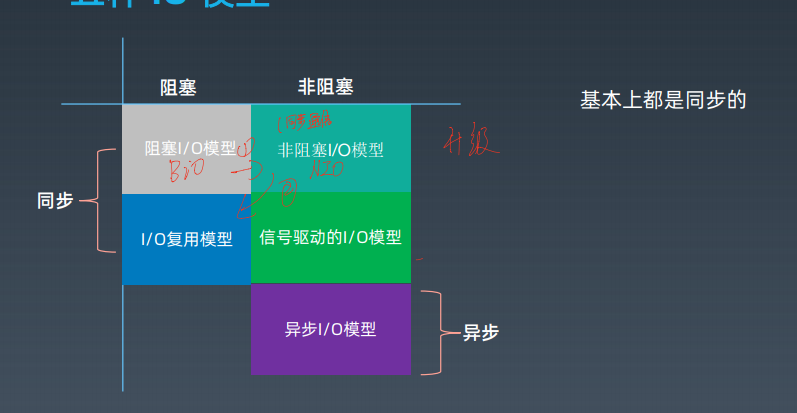
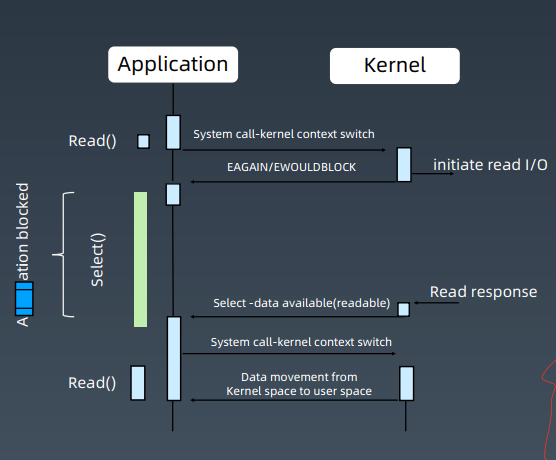

[toc]

# 服务器通信原理

## <a id = "原理图"> 原理图 </a >

首先要明白端口的作用以及意义：

每个服务契都有很多进程，所有的进程都会复用同一个网络同一块网卡跟外面其他所有的辑器打交道。=》 怎么判断这次收发的数据是这个进程所需要的数据。=》 依赖：IP+ 端口。

（IP： 一栋楼地址，端口：楼上具体的几层几号）

每个进程相当于 用户，把自己绑定一个门牌号。

1024 默认保留，不适合用户使用。

## 实现Http 服务器 

使用压测工具

处理过程

> 单线程处理 socket 》 每个请求一个线程
>
> 》 固定大小线程池处理

# I/O 通信 

## <a href="原理图"> 原理图</a> 过程分析

通信 过程，两种类型操作

> - CPU 计算/业务处理
> - IO 操作与等待/网络、磁盘、数据库

存在CPU 使用率低

### 解决方案

> 统筹学

### 底层问题

socket 通信过程，现在在内核空间存在有个<a id="缓冲区">缓冲区</a>（存网卡数据），然后再在用户空间进行cv 处理，如下图：

#### 优化方案：

> 1.  缓冲区 只用一块，不用再拷贝 = epoll
> 2. 线程：单线程永远不是最优的（I/O、CPU 都要他处理）
> 3. 流水线处理：把I/O 过程拆分不同步骤（每个步骤由一个线程池处理）

# NIO 模型与相关概念

- 同步、异步 =》 **通信模式** (TODO 待补充？双工、半双工、全工)
- 阻塞、非阻塞 =》 线程处理模式

## 五种I/O 模型

### 阻塞式IO => BIO

注意事项

> 1. 需要等待内核把数据准备好
> 2. 准备好后，用户空间 将 上面的 “<a href="缓冲区">缓冲区</a>”进行cv
> 3. 业务线程处理数据报文

#### 时序图

解读：

> 内核等待数据到达后，并将数据写入到内核，然后会唤醒业务线程， 业务线程就拷贝到自己空间

###  非阻塞式IO

与阻塞式IO 对比

> 1. 请求的时候立即返回结果
> 2. 调用RecvFrom 后，一旦数据准备好了，内核开始将数据复制到<a href="缓冲区">缓冲区</a> 中
> 3. 接着上面，复制完后，那么阻塞，返回成功，应用程序便可以处理数据了。

前半部分 =》 非阻塞的

> 需要不断主动询问 kernel 数据

后半部分 =》 阻塞的。

#### 时序图

> 需要 用户线程不断 轮询结果的。
>
> =》 导致结果：资源相对浪费。

### IO 复用 （事件驱动IO）

> 事件驱动模型
>
> VS 非阻塞IO 模型
>
> - 非阻塞IO ：每个用户线程（业务线程） 负责整个IO 操作里全流程各个阶段处理（一杆子捅到底）

基本流程图

解读：

> 1. 上面一部分式 非阻塞的，而是由kernel 进行告知，回调的情况。 =》 所以压力都来到了kernel
> 2. 下半部分跟 非阻塞式IO 一样都是阻塞
>    1. 内核将socket 数据复制到<a href = "缓冲区"> 缓冲区</a> 后，进行告知应用程序。

流程：

> 1. 首先得有一个单线程 =》 监听多个套接字 （通过select 或 poll 轮询所负责的所有socket ）
>    1.  问题：select 或 poll  是什么？linux 的机制？
> 2. 当某个socket 由数据到达了， 通知用户线程。

本质：

> 由kernel 负责请求线程 的轮询操作 ，利用select 系统调用

优点：

> 可以多路复用

缺点：

> 相比 非阻塞IO  多个系统调用开销。

阻塞点：

> 1. 进程阻塞在select/poll 上
> 2. 阻塞在第二阶段

#### 时序图

底层构建

解读：

> 1. application read 的时候， 系统 切换内核上下文，内核进行 initialte reade I/O (发起读IO 操作)，后续返回eagain/ewouldblock

解读：

> 

select / poll 的几大缺点

> （1） 每次调用select， 都需要把fd 集合从用户态拷贝到内核态，这个开销在fd 时会很大 （来回拷贝）
>
> 	- 在linux 上所有操作的内容（网络连接，socket 描述符） 都是文件描述符fd(file descriptor)
>
> （2） 同时每次调用select 都需要在内核遍历传递进来的所有fd， 这个开销在fd 很多时也很大、（便利开销大）
>
> （3） select 支持的文件描述符 数量太小， 默认时1024

解决方案：

> epoll - 代替POSIX select 和 poll 系统调用
>
> （1） 内核与用户空间共享一块内存 （解决<a href ="缓冲区"> 缓冲区</a> 的问题）
>
> （2） 通过回调解决便利问题
>
> （3） fd 没有限制，可以支撑10w 连接

