[toc]


# 工具

## 内置命令行工具

基础：JDK bin 目录下有的。

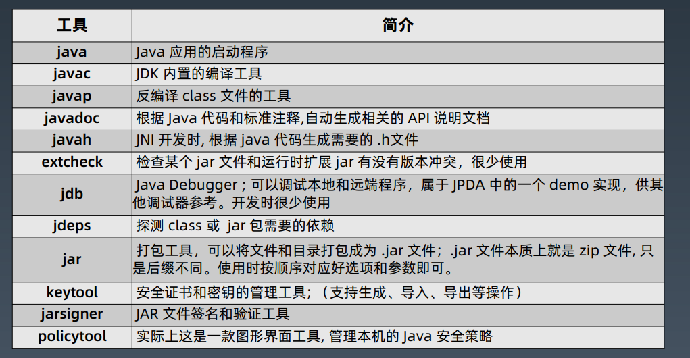


## 常见配合使用

### jps/jinfo =》 查看java 进程

这里存在的坑：

①：linxu jps 显示不全（需要sudo）

② ：不同JDK 版本，JPS 也显示不全，或操作不全

- 解决方案：使用一个JDK 运行，避免上面的②的问题


### jstat =》 查看JVM 内部gc 相关信息

> \>jstat -options
>
> -class 类加载(Class loader)信息统计
>
> -compiler JIT 即时编译器相关的统计信息
>
> <font color = "red">-gc</font> GC 相关的堆内存信息。 用法: jstat -gc -h 10 -t 864 1s 20 <font color="#FFA500">这句话是什么意思？TODO 待补充</font>
>
> 	- 例子：jstac -gc 19459 1000 1000 (pid， 打1k次，每次1000ms)
> 	- 这里呈现的是**字节数**
>
> <font color = "red">-gcutil</font> GC 相关区域的使用率（utilization）统计
>
> 	- 使用 jstac -gcutil -t 19459 1000 1000   （-t 会呈现时间戳）
> 	- 与上面的区别，这个现实的缩减信息，呈现**百分比**
>
> -gccapacity 各个内存池分代空间的容量
>
> -gccause 看上次 GC，本次 GC（如果正在 GC 中）的原因， 其他输出和 -gcutil 选项一致
>
> -gcnew 年轻代的统计信息。（New = Young = Eden + S0 + S1）
>
> -gcnewcapacity 年轻代空间大小统计
>
> -gcold 老年代和元数据区的行为统计
>
> -gcoldcapacity old 空间大小统计
>
> -gcmetacapacity meta 区大小统计
>
> 
>
> -printcompilation 打印 JVM 编译统计信息

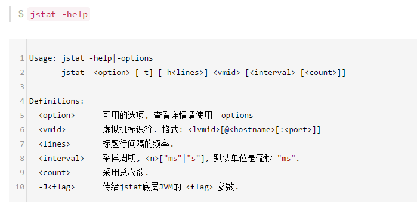

#### jstat -gcutil -t pid 1000 1000

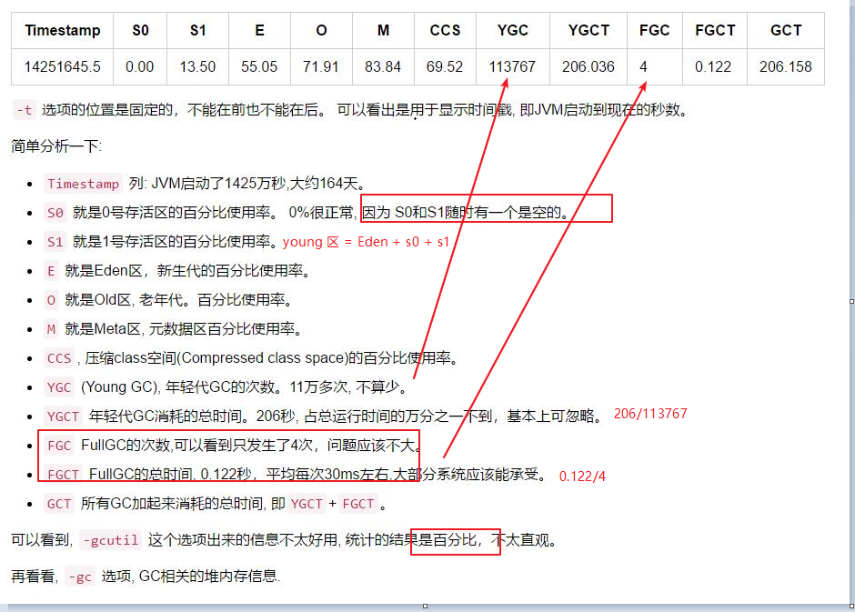


#### jstat -gc -t pid 1000 1000

.jpg)


### jmap =》 产看heap 类或占用空间统计 

**作用：堆当前堆内存打一个快照**

选项：

>**-heap** 打印**堆内存（/内存池）**的配置和使用信息。
>
>**-histo** 看哪些类**占用的空间最多**, 直方图。
>
>-dump:format=b,file=xxxx.hprof Dump 堆内存。 => 这是二进制文件


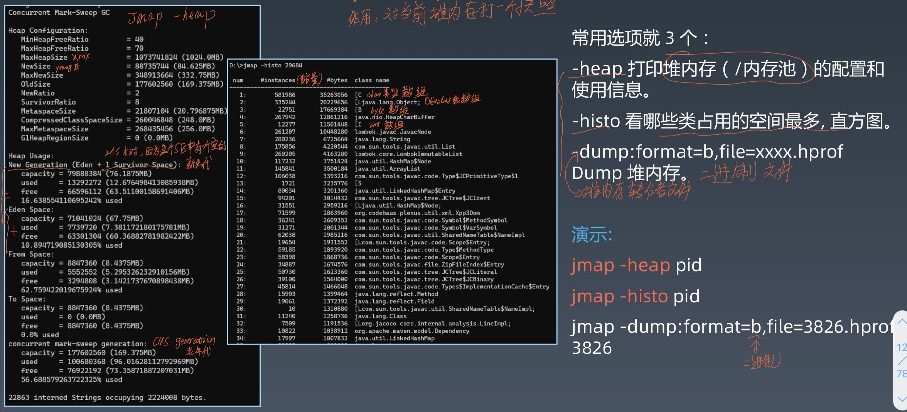


### jstack =》 查看线程信息

>-F 强制执行 thread dump，可在 Java 进程卡死（hung 住）时使用，此选项可能需要系统权限。
>-m 混合模式（mixed mode)，将 Java 帧和native 帧一起输出，此选项可能需要系统权限。
>
>​    -> native 桢：Java 程序
>
>-l 长列表模式，将线程相关的 locks 信息一起输出，比如持有的锁，等待的锁。
>
>常用：jstack -l pid


jstack => 等价于 kill -3 pid (在linux 或者mac 上使用) 在线程执行下打印（正在运行的内容）


### jcmd =》 执行JVM 相关分析命令(整合命令)

包括：GC，线程、VM

>jcmd pid VM.version == 虚拟机版本信息
>jcmd pid VM.flags == VM 参数
>jcmd pid VM.command_line == 命令行信息
>jcmd pid VM.system_properties == 系统环境变量
>jcmd pid Thread.print == 线程堆栈打印
>jcmd pid GC.class_histogram == VM 内部的堆内存统计直方图打印 =》 jmap -histo
>jcmd pid GC.heap_info == 堆内存统计信息打印


---------

jrunscript/jss


## 图形化工具

- jconsole
- jvisualvm =》 可能没打包到JDK 里面，需要下载
  - 强大的地方在于： 抽样器、Profiler
    - 热点-
- VisualGC => IDEA 工具
- jmc（Java Missin Control）
  - 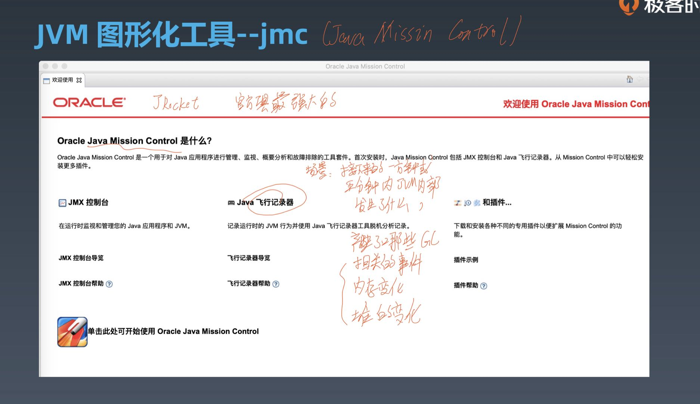
  - 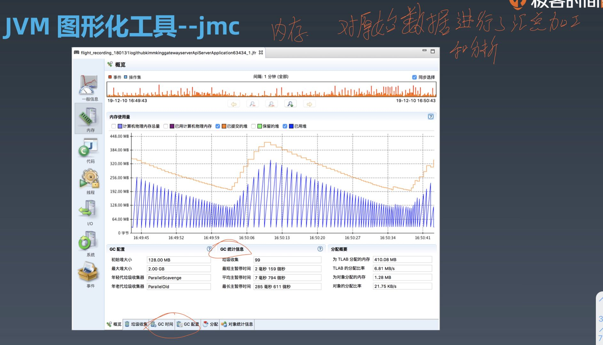


注意：可以使用jenv 管理多个不同的JDK 环境


# GC 策略

书籍笔记 

## 背景 & 一般原理

为什么会有GC

​	=》  本质上是内存资源的有限性


[JVM之GC常用配置参数_贾红平-CSDN博客_gc参数](https://blog.csdn.net/qq_18603599/article/details/81319176)


### 一般原理

>问：程序一致在运行，时时刻刻都有对象正在创建，产生新的对象以及销毁；以及对象之间的关系一直在改变；做GC 的时候，把对象关系标记清除？（保证标记和清理的结果是正确的）
>
>RE：STW stop the world：让当前JVM 内部线程都暂停。


#### 引用计数

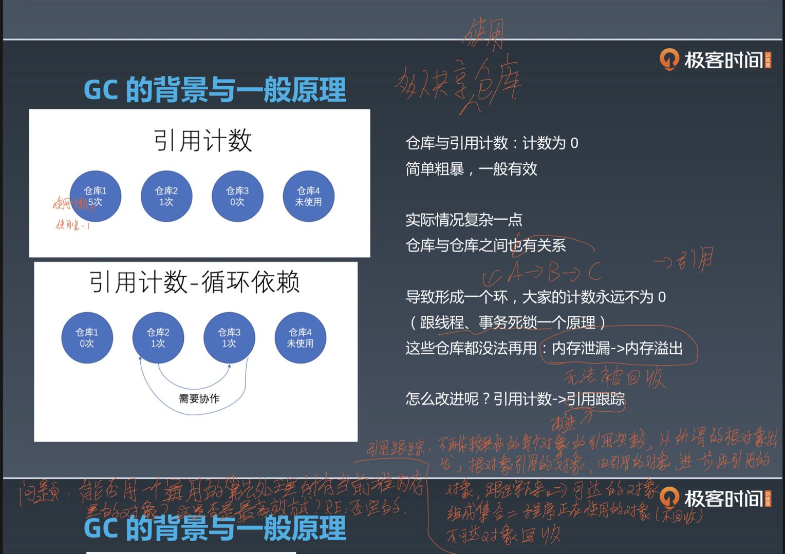

引用计数：用一次，清一次。

- 缺陷：无法处理 环依赖的情况。循环引用会导致 环，无法清零。=》 时间一长，仓库就会爆掉。
- 对应的就是，内存泄漏 -》 进一步内存移除。


优化方案：

- 引用计数 -》 优化成 **<a href = "引用跟踪">引用跟踪</a>**

  - 

    

#### <a id = "引用跟踪">引用跟踪</a>

- 不再依赖具体的每个对象的引用次数，从所谓的根对象触发，根对象引用的对象，由引用的对象进一步再引用对象 ，跟踪下来 =》 就是：**可达的对象** 组成集合 = 程序正在使用的对象（不回收） =》 对应：**不可达对象** 回收。


##### 具体实现

<a id = "标记清除算法">**标记清除算法**(Mark and Sweep) </a>

- 这是两个阶段来的。

>• <a id = "标记阶段">Marking（标记）</a>: 遍历所有的可达对象，并在本地内存(native)中分门别类记下。
>• Sweeping（清除）: 这一步保证了，不可达对象所占用的内存，在之后进行内存分配时可以重用。


<font color="red">备注：并行GC 和CMS 的基本原理 =》 标记清除算法</font>

优势：可以处理循环依赖，只扫描部分对象


#####  压缩

标记和清除后，需要压缩


##### 问题：怎么才能标记和清除清楚上百万对象呢？

STW = GC 暂停。要求：越短越好；频率月底越好。

> STW 是后面不同GC 算法在细节上做了很多优化，是优化核心的出发点。


### 分代假设

分代假设前提：大部分新生对象很快无用；存活较长的对象，可能存活更长时间。

背景图：

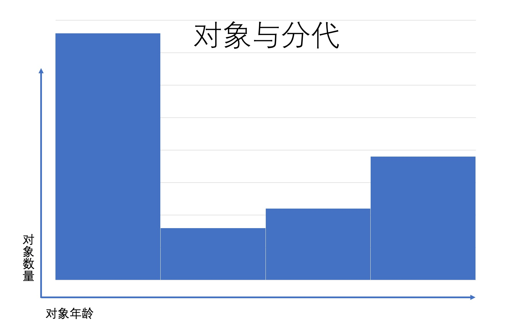


<font color="red">**进一步处理方案：划分内存池区域。 =》 不同类型对象不同区域，不同策略处理。**</font>

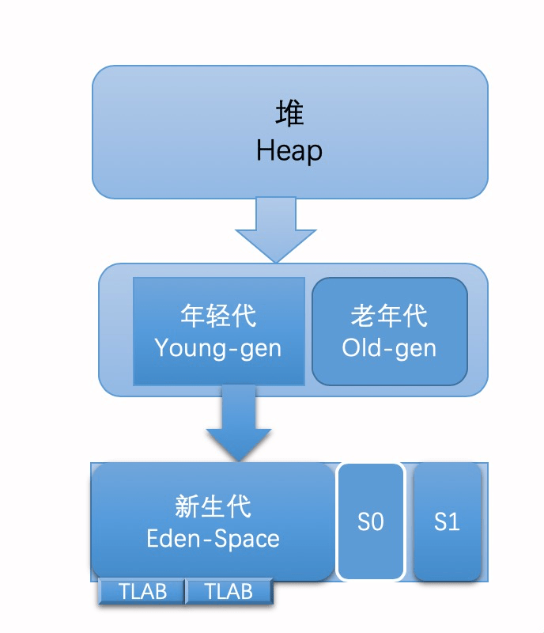

分代情况 说明：

>- 年轻代
>    - 新生代
>    - S0
>    - S1
>- 老年代


#### 晋升阈值配置

从年轻代进入到老年代 阈值配置：

>-XX：+MaxTenuringThreshold=15


#### GC 对象在内存池之间转移

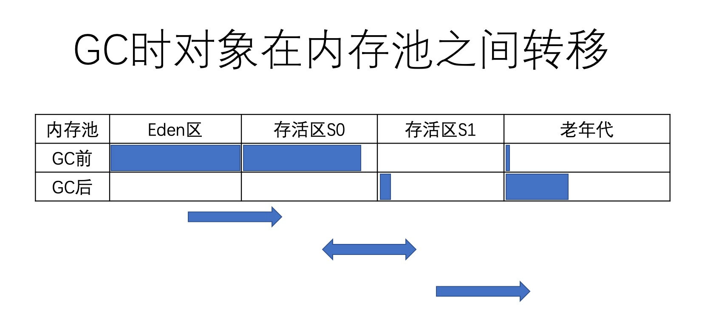

备注：

>新创建的对象在新生代的Eden 区
>
><a href= "标记阶段"> 标记阶段</a> Eden 区存活的对象复制到存活区
>
>- <font color="red">问题：为什么是复制，不是移动？？？</font>
>   - RE：复制之后，那么就可以Eden 区进行全量清除。而不用采用一个个移动的情况。
>- 两个存活区 from 和to 互换角色=》 S0  和S1 同一时刻最多存在一个有数据，现在有数据的就是from，没数据的就是下一轮要接收的to。
>   - from： 就是有数据收
>   - to：转移目标数据就是to
>
>老年代 采用移动方式 （内存的碎片整理）
>
>1. 标记所有的通过GC roots 可达的对象
>2. 删除所有不可达对象
>3. 整理老年代空间中的内容，方法是将所有的存活对象复制，从老年代空间开始的地方一次存放
>
>- **移动的原因：老年代没有继续分区**


### GC Root 对象

>1. 当前正在执行的方法里的局部变量和输入参数（**针对的是局部变量、参数对象，这里这里GC 针对的是堆**） 【方法执行完之前都是有效的】
>
>2. 活动线程（Active trhread）
>3. 所有类的静态字段（static field）
>4. JNI 引用

其他事项

>一般GC 扫描根对象是非常快的 =》 因为：当前所有的活动线程数是固定而有限的，所有的活动线程正在能够执行的这些方法也是固定的。


### 三种算法区别

#### 清除算法（标记-清除 Mark-Sweep）

<a href = "标记清除算法">标记清除算法</a> ： 最终所有的可达存活对象 =》 都会STW

>标记清除算法最重要的优势，就是不再因为循环引用而导致内存泄露：
>
>处理方式不好的地方在于：垃圾收集过程中，需要暂停应用程序的所有线程。STW 停顿

实现方式：

>使用 空闲表(free-list)，记录所有的空闲区域，以及每个区域的大小。
>
>维护空闲表增加对象分配时的开下。此外还存在另一个弱点 -- 有空闲内润，没有一个区域的大小能够存放需要分配的对象，从而导致分配失败（OOME）


#### 复制算法（标记-复制 算法 Mark-Copy）

与<a href = "标记清除算法">标记清除算法</a> 区分别点

>MC 将内存移动到另外一个空间

优点：

>标记和复制可以同时进行

缺点：

> 需要额外的内存空间，来存放所有的存活对象

使用场景

> 年轻代 用 =》 Eden 区和存活区之间的 标记-复制算法。


#### 整理算法（标记-清除-整理 算法 Mark-Sweep-Compact）

在<a href = "标记清除算法">标记清除算法</a> 的基础上进行内存碎片整理。

这个过程让所有可达对象(reachable objects)依次排列，以消除(或减少)碎片。
就像是我们把棋盘上剩余的棋子都聚集到一起。

>JVM中的引用是一个抽象的概念,如果GC移动某个对象，就会修改(栈和堆中)所有指向该对象的引用。
>
>移动/拷贝/提升/压缩 一般来说是一个 STW 的过程，所以修改对象引用是一个安全的行为。但要更新所有的引用,可能会影响应用程序的性能。

缺点：

>GC 暂停时间会增加。

优点：

>分配新对象很简单，通过指针碰撞(pointer bumping)即可


## GC 具体实现

**大多数JVM都需要使用两种不同的GC算法 —— 一种用来清理年轻代，另一种用来清理老年代。**

如果不通过参数明确指定垃圾收集算法，则会使用相应JDK版本的默认实现


### 串行GC（Serial GC）

配置串行GC：==（同时对年轻代和老年代生效）==

```shell
-XX:+UseSerialGC 
```

串行GC对年轻代使用 ==mark-copy（标记-复制）== 算法，对老年代使用 ==mark-sweep-compact（标记-清除-整理）== 算法。

**两者都是单线程的垃圾收集器，不能进行并行处理，所以都会触发==全线暂停（STW）==，停止所有的应用线程。**

>  问题：该选项只适合几百 MB 堆内存的 JVM，而且是单核 CPU 时比较有用。
>
>  RE：内存大，单线程效率低。
>
> 大多数服务器端应用部署在多核平台上，选择 串行 GC 就意味着人为地限制了系统资源的使用，会导致资源闲置，多余的CPU资源也不能用增加业务处理的吞吐量。


### 并行GC（Parallel GC）

>解读：并行是多线程

并行垃圾收集器这一类组合，在年轻代使用 ==标记-复制（mark-copy）==算法 ，在老年代使用 ==标记-清除-整理（mark-sweep-compact）==算法 。

年轻代和老年代的垃圾回收都会触发==STW事件==，暂停所有的应用线程来执行垃圾收集。

并行的特点：==**两者在执行 标记和 复制/整理 阶段时都使用多个线程**==


配置GC 并行线程数(其默认值为 CPU 核心数)

```
-XX：ParallelGCThreads=N 
```


开启并行GC 配置指令（任意一组）

>-XX:+UseParallelGC
>-XX:+UseParallelOldGC
>-XX:+UseParallelGC -XX:+UseParallelOldGC


并行垃圾收集器适用于多核服务器，主要**目标**是**增加吞吐量**。因为对系统资源的有效使用，能达到更高的吞吐量:[（最优） ！= GC 暂停时间短 ]【因为此GC的所有阶段都不能中断，所以并行GC很容易出现**长时间的卡顿** （注：这里说的长时间也很短，一般来说例如minor GC是毫秒级别，full GC是几十几百毫秒级别）。】

> - **在GC期间，所有 CPU 内核都在并行清理垃圾，所以总暂停时间更短；**
> - **在两次GC周期的间隔期，没有GC线程在运行，不会消耗任何系统资源。**（处理业务）

>如果系统的主要目标是最低的停顿时间/延迟，而不是整体的吞吐量最大，那么就应该选择其他垃圾收集器组合。

```shell
注: 长时间卡顿的意思是，此GC启动之后，属于一次性完成所有操作，于是单次 暂停 的时间会较长。
```


### CMS GC（Mostly Concurrent Mark adn Sweep Garbage Collector）

>并发：多个不同类型线程执行
>
>- 这里不同类型 例如 业务线程、GC 线程
>
>- 所以CMS GC 是并发就是说：我的业务线程和GC 线程可以同个阶段一并处理。减少业务停顿时间。
>
>还有就是：CMS GC 的阶段只是针对老年代处理。 =》 这里的 标记清除 算法是处理成说六个大阶段的。

=> 中文名称：最大可能性的并发-标记-清除-垃圾回收算法

其对年轻代采用==**并行 STW**==方式的 mark-copy (标记-复制)算法 ，对老年代主要使用
==并发==mark-sweep (标记-清除)算法 。

> 并行STW 的mark-copy =》 表示的是多线程进行对年轻代进行GC 
>
> 对老年代主要使用==并发==mark-sweep (标记-清除)算法  =》 六大阶段

CMS GC的设计**目标**是避免在老年代垃圾收集时出现长时间的卡顿，主要通过两种手段来达成此目标：

> 1. **不对老年代进行整理，而是使用空闲列表（free-lists）来管理内存空间的回收。**
> 2. **在 mark-and-sweep （标记-清除） 阶段的大部分工作和应用线程一起<font color = "red">并发执行</font>。**【GC 线程和应用线程争抢CPU 时】

=> 在这些阶段并没有明显的应用线程暂停。 

一些注意事项：

> 1、默认情况下，CMS 使用的并发线程数等于 CPU 核心数的 1/4
>
> 2、在进行老年代并发回收时，可能会伴随着多次年轻代的minor GC ( = young gc) 


#### CMS 优点（场景）：

> 调优目标：**降低GC 停顿导致的系统延迟**。（多核CPU）


#### 思考（问题）

**并行Parallel 与并发Concureent (CMS) 的区别**

>- 相同点：
>  - 多个线程做GC 回收
>- 不同点
>  - 不同点1
>    - Parallel GC 使用所有线程进行处理回收，业务线程会被暂停（都会触发STW）
>    - CMS GC 线程和业务线程大多数情况下同时运行
>  - 不同点2
>    - Parallel GC 整个过程都会伴随（触发）STW
>    - CMS GC 只有阶段1、4才会触发STW，其他阶段所执行的线程会与业务线程并发处理。
>
>


#### 阶段（针对老年代回收）

##### 阶段1： Initial Mark（初始标记） - STW

> 特点：伴随STW 暂停

初始标记的目标是标记**所有的根对象**，包括根对象**直接引用的对象**，以及被年轻代中所有存活对象所**引用的对象**（老年代单独回收）。

**示意图：**

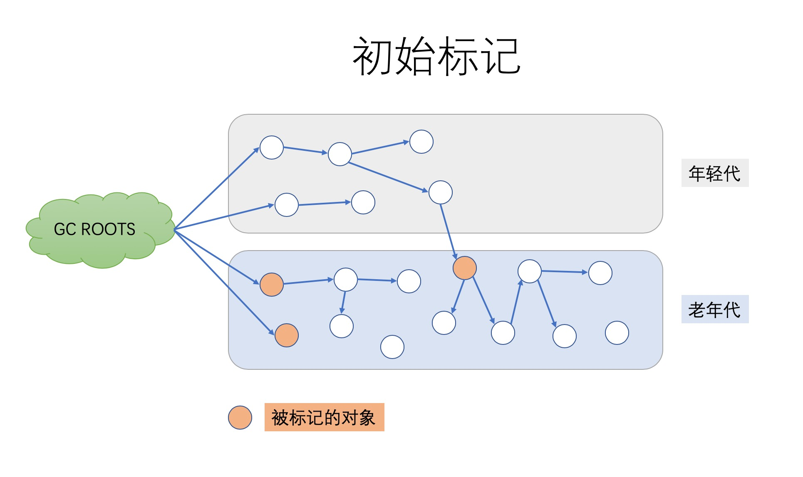


##### 阶段2：<a id = "并发标记"> ConcurrentMark（并发 标记）</a>

>CMS GC 遍历老年代，标记所有的存活对象，从前一阶段“Initial Mark” 找到根对象开始算起。

**注意：并非所有老年代中存活的对象都在此阶段被标记，因为在标记过程中对象的引用关系还在发生变化。**

示意图：

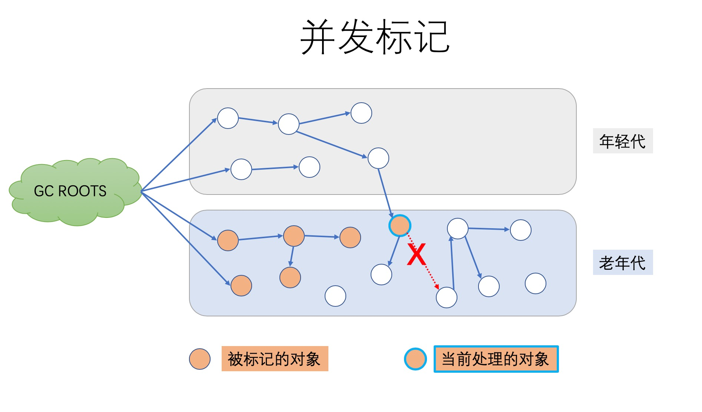

> “ 当前处理的对象 ” 的一个引用就被应用线程给断开了，即这个部分的对象关系发生
> 了变化


##### 阶段3：Concurrent Preclean（并发预处理）

###### 标记情况 - 卡片标记

特点:

> 不停止应用线程。=》 并发处理

**卡片标记（Cark Marking）**

> 缘由：：<a href= "并发标记"> ConcurrentMark（并发 标记）</a> 并发运行 =》 一些引用关系发生了变化 =》 JVM 通过“Card（卡片）”的方式将改变的区域标记为**“脏区”**

如下示意图:

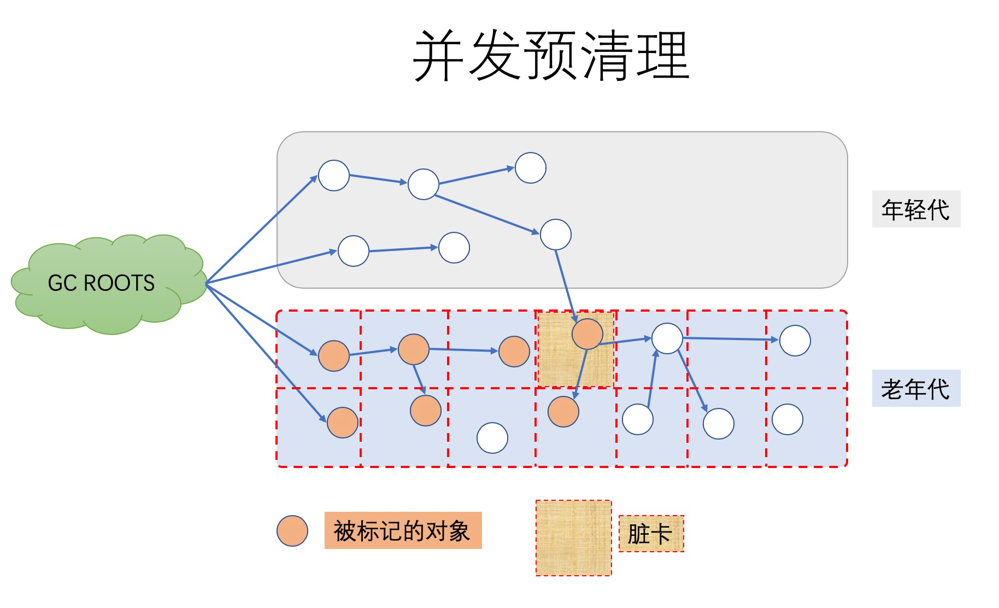


###### 清理完成情况

承接上图，示意图：

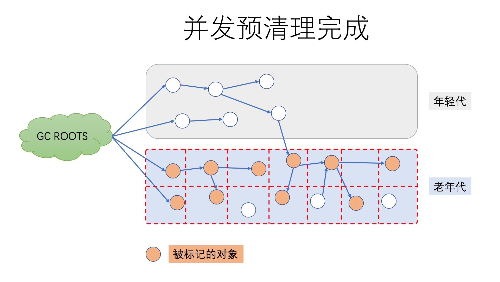

> 在预清理阶段，这些脏对象会被统计出来，他们所引用的对象也会被标记。此阶段完成后，用以标记的card 也就会被清空。

此外，本阶段也会进行一些必要的细节处理， 还会为 Final Remark 阶段做一些准备工作。

> <font color= "bellow">问题</font>：必要的细节处理是什么？


###### 小阶段：Concurrent Abortable Preclean(可取消的并发预清理)

> 此阶段也不停止应用线程。本阶段尝试在 STW 的 <a href= "Final Remark">Final Remark</a>阶段 之前尽可能地多做一些工作。本阶段的具体时间取决于多种因素，因为它循环做同样的事情，直到满足某个退出条件( 如迭代次数，有用工作量，消耗的系统时间等等)。
>
> 此阶段可能显著影响STW停顿的持续时间，并且有许多重要的配置选项和失败模式。


#####  阶段4 <a id = "Final Remark">Final Remark（最终标记）</a> -  STW

> 特点：此次 GC 事件中 最后一次STW 停顿

通常CMS会尝试在年轻代尽可能空的情况下执行 Final Remark 阶段，以免连续触发多次 STW 事件。（因为 年轻代是并行的 标记-复制 算法，会触发STW）


##### 阶段5 Concreent Sweep（并发清理）

特点：

> 不需要STW 停顿，删除老年在不在使用的对象，回收内存空间

示意图：

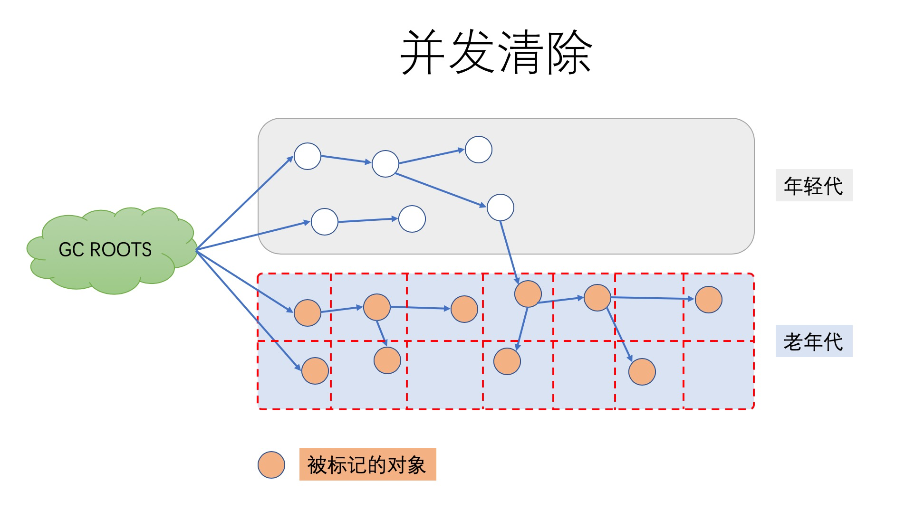


#####  阶段6 Concurrent Reset （并发重置）

作用：

> 重置CMS算法相关的内部数据，为下一次GC循环做准备


#### 缺点

> 最大的问题就是老年代内存碎片问题（因为不压缩），在某些情况下GC会造成不可预测的暂停时间，特别是堆内存较大的情况下。


###  G1 GC - STW

设计方向：

> G1的全称是 Garbage-First ，意为垃圾优先，哪一块的垃圾最多就优先清理它。


主要设计目标：

> 将STW停顿的时间和分布，变成可预期且可配置的。
>
> - G1 GC是一款软实时垃圾收集器，可以为其设置某项特定的性能指标。例如可以指定: 在任意 xx毫秒时间范围内，STW停顿不得超过 yy 毫秒。 举例说明: 任意 1秒 内暂停时间不超过 5毫秒 。G1 GC会尽力达成这个目标（有很大概率会满足，但并不完全确定）。


#### 特点

##### 划分region 区域（小堆块区域 smaller heap regions）

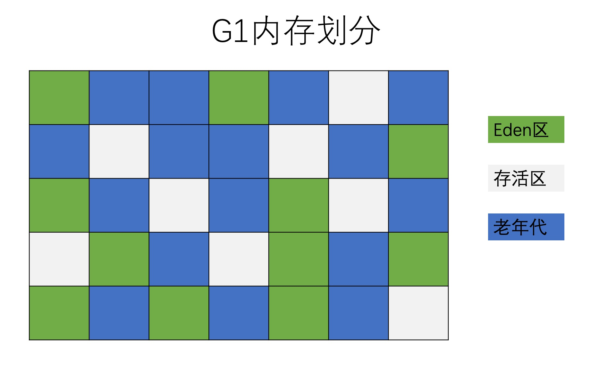

划分范围

- Eden 区
- 存活区 survivor 
- Old 区

逻辑说明： Eden 区+ 存活区 =》  年轻代


#####  增量处理

每次只处理一部分内存块 =》 GC 的回收集（collection set）

每次GC暂停都会收集所有年轻代的内存块，但一般只包含部分老年代的内存块，见下图带对号的部分：

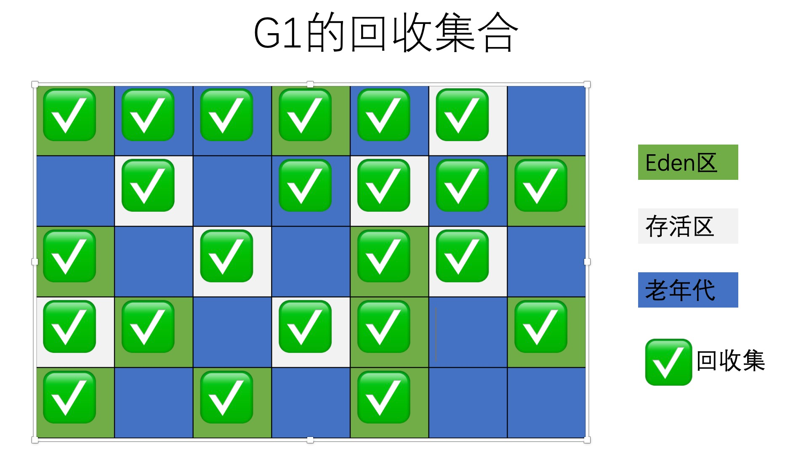


######  回收集原则

G1的另一项创新是，在并发阶段估算每个小堆块存活对象的总数。构建回收集的原则是： 垃圾**最多**的小块会被优先收集。


#### 配置参数

> - -XX:+UseG1GC ：启用G1 GC，JDK7和JDK8要求必须显示申请启动G1 GC；
> - <font color="red">-XX:G1NewSizePercent </font>：初始年轻代占整个Java Heap的大小，默认值为5%；
> - <font color="red">-XX:G1MaxNewSizePercent </font>：最大年轻代占整个Java Heap的大小，默认值为60%；
> - <font color="red">-XX:G1HeapRegionSize </font>：设置每个Region的大小，单位MB，需要为1，2，4，8，16，32中的某
>   个值，默认是堆内存的1/2000。如果这个值设置比较大，那么大对象就可以进入Region了。
> - <font color="red">-XX:ConcGCThreads </font>：与Java应用一起执行的GC线程数量，默认是Java线程的1/4，减少这个参
>   数的数值可能会提升并行回收的效率，提高系统内部吞吐量。如果这个数值过低，参与回收垃圾的线程不足，也会导致并行回收机制耗时加长。
> - <font color="red">-XX:+InitiatingHeapOccupancyPercent</font> （简称IHOP）：G1内部并行回收循环启动的阈值，默认为Java Heap的45%。这个可以理解为老年代使用大于等于45%的时候，JVM会启动垃圾回收。这个值非常重要，它决定了在什么时间启动老年代的并行回收。
> - -XX:G1HeapWastePercent ：G1停止回收的最小内存大小，默认是堆大小的5%。GC会收集所有的Region中的对象，但是如果下降到了5%，就会停下来不再收集了。就是说，不必每次回收就把所有的垃圾都处理完，可以遗留少量的下次处理，这样也降低了单次消耗的时间。
> - -XX:G1MixedGCCountTarget ：设置并行循环之后需要有多少个混合GC启动，默认值是8个。老年代Regions的回收时间通常比年轻代的收集时间要长一些。所以如果混合收集器比较多，可以允许G1延长老年代的收集时间。
> - -XX:+G1PrintRegionLivenessInfo ：这个参数需要和 -
>   XX:+UnlockDiagnosticVMOptions 配合启动，打印JVM的调试信息，每个Region里的对象存活信息。
> - -XX:G1ReservePercent ：G1为了保留一些空间用于年代之间的提升，默认值是堆空间的10%。因为大量执行回收的地方在年轻代（存活时间较短），所以如果你的应用里面有比较大的堆内存空间、比较多的大对象存活，这里需要保留一些内存。
> - -XX:+G1SummarizeRSetStats ：这也是一个VM的调试信息。如果启用，会在VM退出的时候打印出RSets的详细总结信息。如果启用 -XX:G1SummaryRSetStatsPeriod 参数，就会阶段性地打印RSets信息。
> - -XX:+G1TraceConcRefinement ：这个也是一个VM的调试信息，如果启用，并行回收阶段的日志就会被详细打印出来。
> - <font color="red">-XX:+GCTimeRatio</font> ：大家知道，GC的有些阶段是需要Stop-the-World，即停止应用线程的。这个参数就是计算花在Java应用线程上和花在GC线程上的时间比率，默认是9，跟新生代内存的分配比例一致。这个参数主要的目的是让用户可以控制花在应用上的时间，G1的计算公式是100/（1+GCTimeRatio）。这样如果参数设置为9，则最多10%的时间会花在GC工作上面。Parallel GC的默认值是99，表示1%的时间被用在GC上面，这是因为Parallel GC贯穿整个GC，而G1则根据Region来进行划分，不需要全局性扫描整个内存堆。
> - -XX:+UseStringDeduplication ：手动开启Java String对象的去重工作，这个是JDK8u20版本之后新增的参数，主要用于相同String避免重复申请内存，节约Region的使用。
> - <font color="red">-XX:MaxGCPauseMills</font> ：预期G1每次执行GC操作的暂停时间，单位是毫秒，默认值是200毫秒，G1会尽量保证控制在这个范围内。

这里面最重要的参数

> - -XX:+UseG1GC ：启用G1 GC；
> - -XX:+InitiatingHeapOccupancyPercent ：决定什么情况下发生G1 GC；
> - -XX:MaxGCPauseMills ：期望每次GC暂定的时间，比如我们设置为50，则G1 GC会通过调节每次GC的操作时间，尽量让每次系统的GC停顿都在50上下浮动。如果某次GC时间超过50ms，比如说100ms，那么系统会自动在后面动态调整GC行为，围绕50毫秒浮动。


#### 处理步骤

##### 步骤1：年轻代模式转移暂停（Evacuation Pause）


##### 步骤2：并发标记（Concurrent Marking）


##### 步骤3： 转移暂停: 混合模式（Evacuation Pause (mixed)）


### 汇总配置GC 操作说明

