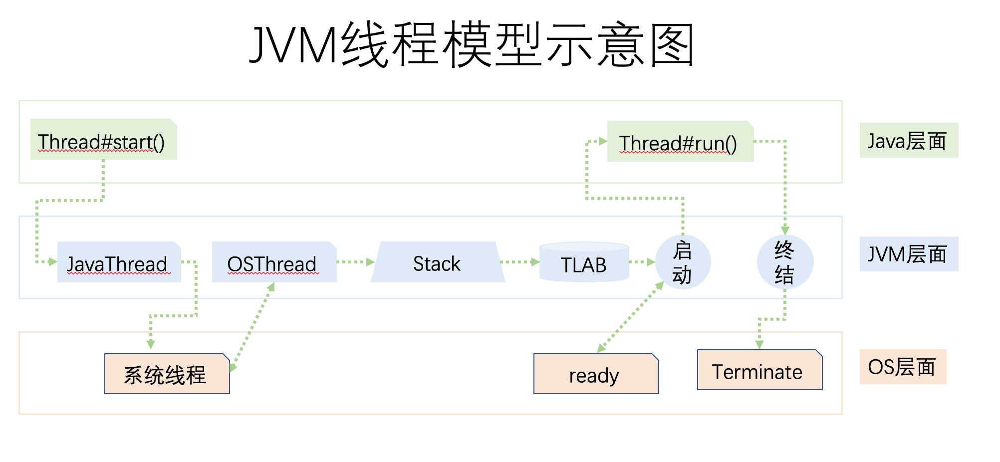

[toc]

# GC 日志解读与分析 ⭐

相关参数例子：

> java -XX:+PrintGCDetails GCLogAnalysis
> java -Xloggc:gc.demo.log -XX:+PrintGCDetails -XX:+PrintGCDateStamps GCLogAnalysis

参数说明：

> -Xloggc:gc.demo.log =》 写入到文件中
>
> -XX:+PrintGCDetails =》 打印GC 细节
>
> -XX:+PrintGCDateStamps =》 打印GC 时的时间戳

名词相关说明：

>  Minor GC （小型GC） ~= Young GC
>
> Major GC（大型GC） ~= Full GC （young gc + old gc）

## 串行GC TODO 实例

## 并行GC TODO 实例

## CMS GC TODO 实例

## G1 GC TODO 实例

## 例子：

退化例子

> 成因，数据
>
> 

## 工具

GCEasy

GCViewer

## 总结：

各种GC 有什么特点和使用场景？

> 

# JVM 线程堆栈分析 

## JVM 线程模型示意图

## JVM内部线程分类

## 安全点

## 线程转储

## 分析工具

fastthread 线程分析

# 内存分析与相关工具 ⭐

内存里面更多的是就是对象，底层就是对象分析。

## 对象问题

> 请思考一个问题：
> 一个对象具有1000个属性，与1000个对象每个具有1个属性，
> 哪个占用的内存空间更大？

## 工具

内存Dump 分析工具

- Eclipse MAT
-  jhat

# JVM 分析调优经验 *

# JVM 疑难情况问题分析

