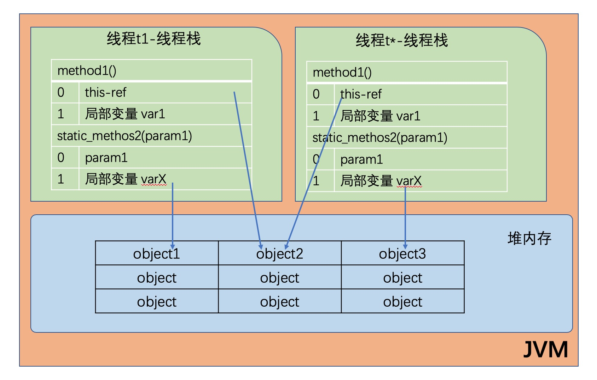
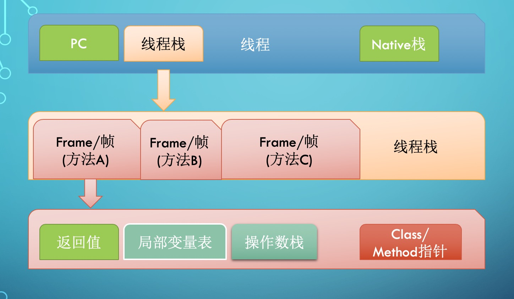

[toc]


# 0. 作业

>**Week01 作业题目**
>
>**1.（选做）**自己写一个简单的 Hello.java，里面需要涉及基本类型，四则运行，if 和 for，然后自己分析一下对应的字节码，有问题群里讨论。
>
>**2.（必做）**自定义一个 Classloader，加载一个 Hello.xlass 文件，执行 Hello 方法，此文件内容是一个 Hello.class 文件所有字节（x=255-x）处理后的文件。文件在我的教室下载。
>
>**3.（必做）**画一张图，展示 Xmx、Xms、Xmn、Meta、DirectMemory、Xss 这些内存参数的关系。
>
>**4.（选做）**检查一下自己维护的业务系统的 JVM 参数配置，用 jstat 和 jstack、jmap 查看一下详情，并且自己独立分析一下大概情况，思考有没有不合理的地方，如何改进。
>
>**注意：**如果没有线上系统，可以自己 run 一个 web/java 项目。
>
>**5.（选做）**本机使用 G1 GC 启动一个程序，仿照课上案例分析一下 JVM 情况。
>
>以上作业，要求 2 道必做题目提交到自己 GitHub 上面，然后把自己的作业链接填写到下方的表单里面：
>[ https://jinshuju.net/f/KCVEZT](https://jinshuju.net/f/KCVEZT)
>
>示例代码参考：
>[ https://github.com/JavaCourse00/JavaCourseCodes](https://github.com/JavaCourse00/JavaCourseCodes)
>学号查询方式：PC 端登录 time.geekbang.org, 点击右上角头像进入我的教室，左侧头像下方 G 开头的为学号
>
>


# 1. JVM 基础知识

## 编程语言的类别信息


## java 性质

>Java 是一种面向对象、静态类型、编译执行，
>有 VM/GC 和运行时、跨平台的高级语言。


## 字节码、类加载器、虚拟机关系


# 2. 字节码技术


## 主要说明

Constant pool： 常量池

LocalVariableTable: 局部变量表


[第 6 章。Java 虚拟机指令集 (oracle.com)](https://docs.oracle.com/javase/specs/jvms/se8/html/jvms-6.html#jvms-6.5.getfield)

可具体观看文件里面的内容 [JVM-1-4-Java字节码技术.pdf](./JVM-1-4-Java字节码技术.pdf)


## 字节码相关概念

Java bytecode 由单字节（byte）的指令组成，理论上最多支持 256 个操作码（opcode）。
实际上 Java 只使用了200左右的操作码， 还有一些操作码则保留给调试操作。

>个人理解：
>
>每个指令都是一个单字节，并且有对应的值所表示，由于用的是16进制所表示，所以二进制所呈现就是两个字节效果。（注意：具体操作指令所需要的信息应该要查相关文档以及总结）
>
>如下图：
>
>


## 生成字节码文件

要呈现 localVeriable table 的数据需要编译的时候 加参数-g

```
javac -g xxx.java
```


```
javap -c -verbose demo.jvm.HelloByteCode
```


## 分析字节码文件

### 数值处理 & 本地变量表的分析


### 指令说明

#### load & store


## 字节码运行时结构

前提：JVM 是一台基于栈的计算机器。

**每个线程都有一个独属于自己的<a id = "线程栈">线程栈(JVM Stack)</a> ，存储栈帧（Frame）。**

**每一次方法调用、JVM 都会自动创建一个栈帧。**

>栈帧由**操作数栈**、 **局部变量数组**以及一个 **Class 引用**组成。
>
>**Class 引用**指向当前方法在运行时常量池中对应的 Class。
>
>


## 方法调用的指令

<font color = "blue">Invokestatic</font>：顾名思义，这个指令用于调用某个类的静态方法，这是方法调用指令中最快的一个。
<font color = "blue">Invokespecial </font>：用来调用构造函数，但也可以用于调用同一个类中的 private 方法, 以及
见的超类方法。
<font color = "blue">invokevirtual </font>：如果是具体类型的目标对象，invokevirtual 用于调用公共、受保护和package 级的私有方法。
<font color = "blue">invokeinterface</font> ：当通过接口引用来调用方法时，将会编译为 invokeinterface 指令。
<font color = "blue">invokedynamic </font>： JDK7 新增加的指令，是实现“动态类型语言”（Dynamically Typed Language）支持而进行的升级改进，同时也是 JDK8 以后支持 lambda 表达式的实现基。


# 3. JVM 类加载器

## 786

### 类的生命周期-7


1. 加载（Loading）：找 Class 文件
2. 验证（Verification）：验证格式、依赖
3. 准备（Preparation）：静态字段、方法表
4. 解析（Resolution）：符号解析为引用
5. 初始化（Initialization）：构造器、静态变
量赋值、静态代码块
6. 使用（Using）
7. 卸载（Unloading）


### 类的加载时机 - 8

1. 当虚拟机启动时，初始化用户指定的主类，就是启动执行的 main 方法所在的类；
2. 当遇到用以新建目标类实例的 new 指令时，初始化 new 指令的目标类，就是 new 一个类的时候要初始化；
3. 当遇到调用静态方法的指令时，初始化该静态方法所在的类；
4. 当遇到访问静态字段的指令时，初始化该静态字段所在的类；
5. 子类的初始化会触发父类的初始化；
6. 如果一个接口定义了 default 方法，那么直接实现或者间接实现该接口的类的初始化，会触发该接口的初始化；
7. 使用反射 API 对某个类进行反射调用时，初始化这个类，其实跟前面一样，反射调用要么是已经有实例了，要么是静态方法，都需要初始化；
8. 当初次调用 MethodHandle 实例时，初始化该 MethodHandle 指向的方法所在的。


### 不会初始化（可能会加载） - 6

1. 通过子类引用父类的静态字段，只会触发父类的初始化，而不会触发子类的初始化。
2. 定义对象数组，不会触发该类的初始化。
3. 常量在编译期间会存入调用类的常量池中，本质上并没有直接引用定义常量的类，不会触发定义常量所在的类。
4. 通过类名获取 Class 对象，不会触发类的初始化，Hello.class 不会让 Hello 类初始化。
5. 通过 Class.forName 加载指定类时，如果指定参数 initialize 为 false 时，也不会触发类初始化，其实这个参数是告诉虚拟机，是否要对类进行初始化。
(Class.forName”jvm.Hello”)默认会加载 Hello 类。
6. 通过 ClassLoader 默认的 loadClass 方法，也不会触发初始化动作（加载了，但是不初始化）。


## 类加载器类型

### 加载过程

先加载AppClassLoader，找不到会由ExtClassLoader 执行，再找不到：BootstrapClassLoader 进行加载。 =》 **双亲委托** （如下图）


### 实现类

这里没有启动类加载器BottstrapClassLoader ，是因为该是由JVM 底层所实现的。


### 加载器特点

TODO 待补充


### 代码例子：显示当前ClassLoader 加载了哪些Jar


### 如何实现自定义ClassLoader ，可以观看到的是哪个类。


### 添加引用类的几种方式

**问题：**什么是引用类？具体泛指什么？有没有例子。


1、放到 JDK 的 lib/ext 下，或者 -Djava.ext.dirs
2、 java-cp/classpath 或者 class 文件放到当前路径
3、自定义 ClassLoader 加载
4、拿到当前执行类的 ClassLoader，反射调用 addUrl 方法添加 Jar 或路径（JDK9 无效） 	=》 **问题：**这个怎么实现？有什么具体例子？ 看回视频


# 4. JVM 内存模型


## JVM 内存结构

### 上层抽象版


**每个线程都只能访问自己的<a href = "线程栈"> 线程栈</a>**

- 每个线程都**不能访问** 其他线程的**局部变量**
  - 所有原生类型的局部变量都存储在线程栈内，因此其他线程是不可见的。
  - 处理方案：线程将原生变量值的副本传给另一个线程，但不能共享原生局部变量本身。

**堆内存**：含义以及特定说明

- 包含了Java 代码中创建的所有对象，不管是哪个线程创建的。其中也涵盖了包装类型（Byte 等）
  - 不管是创建一个对象并将其赋值给局部变量，还是赋值给另一个对象的成员变量，创建的对象都会被保存到堆内存中。
  - 对象的成员变量 与独享本身一起存储在堆上，不管成员变量的类型是原生数值还是对象引用。
- 类的静态变量也是放置此
- 亦称“共享堆”，堆中的所有对象，可以被所有线程访问，只要他们能拿到对象的引用地址。
- 


### 具体详细版





### JVM 内存整体结构


- 解读：
  - 每启动一个线程，JVM 在栈空间分配对应的 <a href = "线程栈">线程栈</a>，比如1MB 的空间(-Xss1m)
    - 线程栈 = Java 方法栈
    - 使用JNI 方法 =》 分配一个单独的本地方法栈。（**问题：什么是本地方法栈**）
    - 每执行一个方法，创建对应的 栈帧（Frame） =》 会导致一个问题，调用链太长了Xss 分配的1m 不够用。
      - 解决方案：进行再配置大小，并且调整


### JVM <font color = "blue">线程栈</font>内存结构



- 解读：
  - 栈帧的大小再一个方法编写完成后基本上就能确定（字节码已经确定了）
  - 


### JVM 堆内存结构


- 解读
  - 堆内存
    - 堆：**受到GC 算法控制对象，堆内存上创建、回收、销毁。**
      - **年轻代**
        - Eden-Space：新生代
        - Survivor space：存活区
          - S0 和 S1，任何时刻，这两个总有一个是空的。
        - **新生代：S1：S2 = 8:1:1**
      - **老年代**
    - 非堆：不归GC 管理
      - Meatspace 元数据区
      - CCS：Compressed Class space： 存放class 信息，和MeataSpace 有交叉
      - Code Cache 存放JIT 编译器编译后的本地机器代码。


# 5. JVM 启动参数

在不同环境实现高效地运行，调节启动参数，做调教效果。


## 标准

- **\- 开头为标准参数=》** 所有JVM 都要实现，并且向后兼容

- \-D 设置系统属性

- \-X 非标准参数，基本传给JVM 的，默认JVM 实现这些参数的功能，但并不保证所有JVM 实现都满足， 且不保证向后兼容。
  - 使用 java -X 命令查看当前JVM 支持的非标准参数
- \-XX 非稳定参数， 转码用于控制JVM 行为，跟具体JVM 实现有关，可能会在下一个版本取消。
  - -XX： +-Flags 形式，+- 对布尔值进行开关。
  - \-XX： key=value 形式，置顶某个选项的指。
- 例如
  - 

## 启动参数分类

### 1. 系统属性参数

\-D 开头的


### 2. 运行模式参数


### 3. 堆内存设置参数


### 4. GC 设置参数


### 5. 分析诊断参数


### 6. JavaAgent 参数


