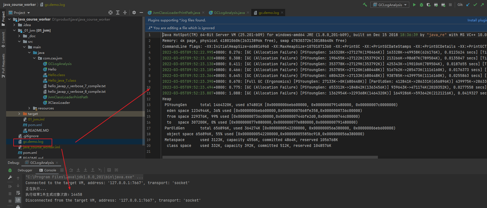
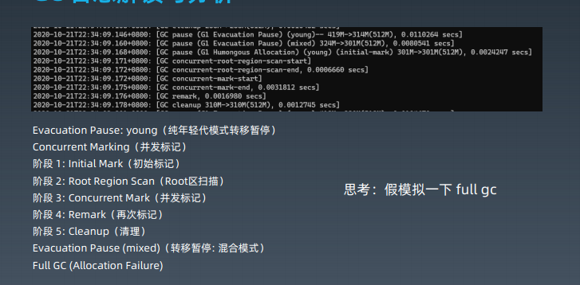

打印GCLogAnalysis 日志，执行完后，会打印相关结果


# GC 日志

## GC 日志解读

### yong gc

>2022-03-05T09:50:05.519+0800: [GC (Allocation Failure) [PSYoungGen: 163328K->27119K(190464K)] 163328K->48952K(626176K), 0.0089635 secs] [Times: user=0.00 sys=0.00, real=0.01 secs] 
>
>时间戳信息：2022-03-05T09:50:05.519+0800: 
>
>-------------------------------------------------------------
>
>GC 本身的情况： [GC (Allocation Failure) [PSYoungGen: 163328K->27119K(190464K)] 163328K->48952K(626176K), 0.0089635 secs]
>
>GC 发生的原因：**Allocation Failure** = 分配内存失败导致的
>
>[PSYoungGen: 163328K->27119K(190464K)] 0.0089635 secs] =》 8.9ms 时间内GC 并行执行的时间（GC 暂停时间）【Java 使用的是并行GC，STW】。这个时间内，**young 区的**大小：159.5M（163328K） 被压缩到26M（27119K），当前young区最大容量：186M(190464K)
>
>163328K->48952K(626176K), => **整个堆内存的情况**：626176K（600M 容量）； 在GC 操作之前，600M 的堆内存使用量也是163328K（159M）左右。整个堆内存压缩完后，这个堆内存还有48M 左右（48952K）
>
>------------------------------------------------------------------
>
>CPU 使用情况：[Times: user=0.00 sys=0.00, real=0.01 secs] 
>
>====
>
>这是第一次发生GC ，因为yong区和 整个堆内存大小一致。那么表示没有old区内容。
>
>yong区：回收了123M， 而整个堆：回收了111M ，期间相差的12M，这12M 的数据是什么？＝》　去了old 区


### fullgc

>2022-03-05T09:50:05.897+0800: [Full GC (Ergonomics) [PSYoungGen: 27122K->0K(680448K)] [ParOldGen: 400987K->275878K(645120K)] 428110K->275878K(1325568K), [Metaspace: 3116K->3116K(1056768K)], 0.0340619 secs] [Times: user=0.19 sys=0.00, real=0.03 secs] 
>
>----------------
>
>old 区（[ParOldGen: 400987K->275878K(645120K)] ）：从400m 压缩到了275m 左右
>
>====
>
>做old 区GC 的时候（Full GC），同时也会进行Young 区GC：直接清空。

## GC 日志相关参数

### 参数

```
-XX:+PrintGCDetails
```

结果：（这里的内存是40g 的情况下，使用10g 作为最大堆）

```
正在执行...
[GC (Allocation Failure) [PSYoungGen: 163328K->27127K(190464K)] 163328K->57773K(626176K), 0.0110935 secs] [Times: user=0.03 sys=0.05, real=0.01 secs] 
[GC (Allocation Failure) [PSYoungGen: 190455K->27129K(353792K)] 221101K->107661K(789504K), 0.0144952 secs] [Times: user=0.03 sys=0.03, real=0.01 secs] 
[GC (Allocation Failure) [PSYoungGen: 353785K->27127K(353792K)] 434317K->206821K(789504K), 0.0171187 secs] [Times: user=0.02 sys=0.06, real=0.02 secs] 
[GC (Allocation Failure) [PSYoungGen: 353783K->27130K(680448K)] 533477K->289715K(1116160K), 0.0158329 secs] [Times: user=0.01 sys=0.06, real=0.01 secs] 
[GC (Allocation Failure) [PSYoungGen: 680442K->27124K(680448K)] 943027K->441558K(1116160K), 0.0266920 secs] [Times: user=0.09 sys=0.08, real=0.03 secs] 
[Full GC (Ergonomics) [PSYoungGen: 27124K->0K(680448K)] [ParOldGen: 414433K->283385K(633856K)] 441558K->283385K(1314304K), [Metaspace: 3117K->3117K(1056768K)], 0.0338611 secs] [Times: user=0.16 sys=0.00, real=0.03 secs] 
[GC (Allocation Failure) [PSYoungGen: 653312K->163679K(1378816K)] 936697K->447064K(2012672K), 0.0255876 secs] [Times: user=0.05 sys=0.11, real=0.03 secs] 
[GC (Allocation Failure) [PSYoungGen: 1378655K->208375K(1453568K)] 1662040K->603633K(2087424K), 0.0458304 secs] [Times: user=0.11 sys=0.09, real=0.05 secs] 
执行结束1共生成对象次数：14689  
Heap  ==> 执行完后，退出之前打印出来堆内存布局的情况
 PSYoungGen      total 1453568K, used 582031K [0x00000006eb600000, 0x0000000798a00000, 0x00000007c0000000)
  eden space 1245184K, 30% used [0x00000006eb600000,0x00000007022e6158,0x0000000737600000)
  from space 208384K, 99% used [0x0000000737600000,0x000000074417dd98,0x0000000744180000)
  to   space 296960K, 0% used [0x0000000786800000,0x0000000786800000,0x0000000798a00000)
 ParOldGen       total 633856K, used 395258K [0x0000000542200000, 0x0000000568d00000, 0x00000006eb600000)
  object space 633856K, 62% used [0x0000000542200000,0x000000055a3fe950,0x0000000568d00000)
 Metaspace       used 3124K, capacity 4556K, committed 4864K, reserved 1056768K
  class space    used 332K, capacity 392K, committed 512K, reserved 1048576K
Disconnected from the target VM, address: '127.0.0.1:7475', transport: 'socket'

Process finished with exit code 0

```


没有配置jvm 相关参数的情况下，java 会默认试用如下

物理内存大于1G：试用1/4 的物理内存，作为当前的虚拟机最大堆内存；小于等于1G，使用1/2 物理内存作为最大堆内存


### 参数

```
-XX:+PrintGCDetails -Xmx1g -Xms1g
```


结果：（这里的内存配置1g 的情况下）

```
正在执行...
[GC (Allocation Failure) [PSYoungGen: 262144K->43508K(305664K)] 262144K->75954K(1005056K), 0.0143414 secs] [Times: user=0.03 sys=0.05, real=0.01 secs] 
[GC (Allocation Failure) [PSYoungGen: 305652K->43518K(305664K)] 338098K->146729K(1005056K), 0.0159771 secs] [Times: user=0.03 sys=0.06, real=0.01 secs] 
[GC (Allocation Failure) [PSYoungGen: 305662K->43519K(305664K)] 408873K->221775K(1005056K), 0.0147068 secs] [Times: user=0.03 sys=0.06, real=0.01 secs] 
[GC (Allocation Failure) [PSYoungGen: 305663K->43515K(305664K)] 483919K->299420K(1005056K), 0.0146778 secs] [Times: user=0.02 sys=0.08, real=0.01 secs] 
[GC (Allocation Failure) [PSYoungGen: 305659K->43517K(305664K)] 561564K->369843K(1005056K), 0.0142258 secs] [Times: user=0.01 sys=0.08, real=0.01 secs] 
[GC (Allocation Failure) [PSYoungGen: 305253K->43516K(160256K)] 631579K->448894K(859648K), 0.0152532 secs] [Times: user=0.00 sys=0.00, real=0.01 secs] 
[GC (Allocation Failure) [PSYoungGen: 160212K->71816K(232960K)] 565590K->483164K(932352K), 0.0082494 secs] [Times: user=0.06 sys=0.01, real=0.01 secs] 
[GC (Allocation Failure) [PSYoungGen: 188552K->87252K(232960K)] 599900K->510267K(932352K), 0.0099101 secs] [Times: user=0.00 sys=0.00, real=0.01 secs] 
[GC (Allocation Failure) [PSYoungGen: 203988K->104520K(232960K)] 627003K->542314K(932352K), 0.0126047 secs] [Times: user=0.06 sys=0.02, real=0.01 secs] 
[GC (Allocation Failure) [PSYoungGen: 220986K->75387K(232960K)] 658781K->566286K(932352K), 0.0130066 secs] [Times: user=0.09 sys=0.00, real=0.01 secs] 
[GC (Allocation Failure) [PSYoungGen: 192123K->42236K(232960K)] 683022K->600531K(932352K), 0.0122909 secs] [Times: user=0.08 sys=0.00, real=0.01 secs] 
[GC (Allocation Failure) [PSYoungGen: 158972K->38947K(232960K)] 717267K->636248K(932352K), 0.0083101 secs] [Times: user=0.05 sys=0.05, real=0.01 secs] 
[Full GC (Ergonomics) [PSYoungGen: 38947K->0K(232960K)] [ParOldGen: 597301K->334915K(699392K)] 636248K->334915K(932352K), [Metaspace: 3116K->3116K(1056768K)], 0.0401707 secs] [Times: user=0.19 sys=0.00, real=0.04 secs] 
[GC (Allocation Failure) [PSYoungGen: 116736K->39539K(232960K)] 451651K->374455K(932352K), 0.0042708 secs] [Times: user=0.00 sys=0.00, real=0.00 secs] 
[GC (Allocation Failure) [PSYoungGen: 156275K->41244K(232960K)] 491191K->412171K(932352K), 0.0085385 secs] [Times: user=0.06 sys=0.00, real=0.01 secs] 
[GC (Allocation Failure) [PSYoungGen: 157722K->43089K(232960K)] 528650K->451264K(932352K), 0.0085478 secs] [Times: user=0.00 sys=0.00, real=0.01 secs] 
[GC (Allocation Failure) [PSYoungGen: 159214K->34311K(232960K)] 567388K->480701K(932352K), 0.0074472 secs] [Times: user=0.00 sys=0.00, real=0.01 secs] 
[GC (Allocation Failure) [PSYoungGen: 150886K->34029K(232960K)] 597276K->511598K(932352K), 0.0070612 secs] [Times: user=0.08 sys=0.00, real=0.01 secs] 
[GC (Allocation Failure) [PSYoungGen: 150124K->46673K(232960K)] 627693K->553513K(932352K), 0.0078267 secs] [Times: user=0.00 sys=0.00, real=0.01 secs] 
[GC (Allocation Failure) [PSYoungGen: 163390K->38600K(232960K)] 670229K->583937K(932352K), 0.0081858 secs] [Times: user=0.00 sys=0.00, real=0.01 secs] 
[GC (Allocation Failure) [PSYoungGen: 155336K->41359K(232960K)] 700673K->622406K(932352K), 0.0079775 secs] [Times: user=0.09 sys=0.00, real=0.01 secs] 
[GC (Allocation Failure) [PSYoungGen: 158052K->36268K(232960K)] 739100K->655410K(932352K), 0.0080549 secs] [Times: user=0.00 sys=0.00, real=0.01 secs] 
[GC (Allocation Failure) [PSYoungGen: 153004K->32731K(232960K)] 772146K->686405K(932352K), 0.0073662 secs] [Times: user=0.00 sys=0.00, real=0.01 secs] 
[Full GC (Ergonomics) [PSYoungGen: 32731K->0K(232960K)] [ParOldGen: 653674K->352862K(699392K)] 686405K->352862K(932352K), [Metaspace: 3116K->3116K(1056768K)], 0.0408507 secs] [Times: user=0.17 sys=0.00, real=0.04 secs] 
[GC (Allocation Failure) [PSYoungGen: 116085K->41255K(232960K)] 468948K->394117K(932352K), 0.0042593 secs] [Times: user=0.00 sys=0.00, real=0.00 secs] 
[GC (Allocation Failure) [PSYoungGen: 157855K->35321K(232960K)] 510717K->425954K(932352K), 0.0087741 secs] [Times: user=0.00 sys=0.00, real=0.01 secs] 
[GC (Allocation Failure) [PSYoungGen: 152057K->39492K(232960K)] 542690K->461776K(932352K), 0.0073746 secs] [Times: user=0.08 sys=0.00, real=0.01 secs] 
[GC (Allocation Failure) [PSYoungGen: 156228K->33656K(233984K)] 578512K->491237K(933376K), 0.0075941 secs] [Times: user=0.00 sys=0.00, real=0.01 secs] 
[GC (Allocation Failure) [PSYoungGen: 151120K->40533K(232960K)] 608702K->526649K(932352K), 0.0075640 secs] [Times: user=0.08 sys=0.00, real=0.01 secs] 
[GC (Allocation Failure) [PSYoungGen: 158293K->39656K(243712K)] 644409K->559819K(943104K), 0.0077786 secs] [Times: user=0.05 sys=0.00, real=0.01 secs] 
[GC (Allocation Failure) [PSYoungGen: 173156K->44441K(239104K)] 693319K->596902K(938496K), 0.0078713 secs] [Times: user=0.00 sys=0.00, real=0.01 secs] 
[GC (Allocation Failure) [PSYoungGen: 178073K->49959K(253440K)] 730534K->641221K(952832K), 0.0090542 secs] [Times: user=0.09 sys=0.00, real=0.01 secs] 
执行结束1共生成对象次数：16978
Heap
 PSYoungGen      total 253440K, used 192621K [0x00000000eab00000, 0x0000000100000000, 0x0000000100000000)
  eden space 153088K, 93% used [0x00000000eab00000,0x00000000f36517b8,0x00000000f4080000)
  from space 100352K, 49% used [0x00000000f9e00000,0x00000000fcec9c68,0x0000000100000000)
  to   space 95744K, 0% used [0x00000000f4080000,0x00000000f4080000,0x00000000f9e00000)
 ParOldGen       total 699392K, used 591262K [0x00000000c0000000, 0x00000000eab00000, 0x00000000eab00000)
  object space 699392K, 84% used [0x00000000c0000000,0x00000000e4167a18,0x00000000eab00000)
 Metaspace       used 3123K, capacity 4556K, committed 4864K, reserved 1056768K
  class space    used 332K, capacity 392K, committed 512K, reserved 1048576K
```


### 参数

gc 执行打印时间戳

```
-XX:+PrintGCDetails -XX:+PrintGCDateStamps
```

结果

2022-03-05T09:50:05.519+0800: [GC (Allocation Failure) [PSYoungGen: 163328K->27119K(190464K)] 163328K->48952K(626176K), 0.0089635 secs] [Times: user=0.00 sys=0.00, real=0.01 secs] 

时分秒.毫秒数 东八区

```
2022-03-05T09:50:05.519+0800: [GC (Allocation Failure) [PSYoungGen: 163328K->27119K(190464K)] 163328K->48952K(626176K), 0.0089635 secs] [Times: user=0.00 sys=0.00, real=0.01 secs] 
2022-03-05T09:50:05.549+0800: [GC (Allocation Failure) [PSYoungGen: 190447K->27132K(353792K)] 212280K->96039K(789504K), 0.0101724 secs] [Times: user=0.00 sys=0.00, real=0.01 secs] 
2022-03-05T09:50:05.646+0800: [GC (Allocation Failure) [PSYoungGen: 353788K->27130K(353792K)] 422695K->180921K(789504K), 0.0151722 secs] [Times: user=0.05 sys=0.05, real=0.02 secs] 
2022-03-05T09:50:05.695+0800: [GC (Allocation Failure) [PSYoungGen: 353786K->27125K(680448K)] 507577K->275724K(1116160K), 0.0159822 secs] [Times: user=0.03 sys=0.06, real=0.02 secs] 
2022-03-05T09:50:05.870+0800: [GC (Allocation Failure) [PSYoungGen: 680437K->27122K(680448K)] 929036K->428110K(1116160K), 0.0264715 secs] [Times: user=0.06 sys=0.13, real=0.03 secs] 
2022-03-05T09:50:05.897+0800: [Full GC (Ergonomics) [PSYoungGen: 27122K->0K(680448K)] [ParOldGen: 400987K->275878K(645120K)] 428110K->275878K(1325568K), [Metaspace: 3116K->3116K(1056768K)], 0.0340619 secs] [Times: user=0.19 sys=0.00, real=0.03 secs] 
2022-03-05T09:50:06.000+0800: [GC (Allocation Failure) [PSYoungGen: 653312K->177005K(1344512K)] 929190K->452884K(1989632K), 0.0231082 secs] [Times: user=0.02 sys=0.08, real=0.02 secs] 
2022-03-05T09:50:06.299+0800: [GC (Allocation Failure) [PSYoungGen: 1344365K->223215K(1458688K)] 1620244K->582557K(2103808K), 0.0396658 secs] [Times: user=0.06 sys=0.09, real=0.04 secs] 
执行结束1共生成对象次数：15769
Heap
 PSYoungGen      total 1458688K, used 990594K [0x00000006eb600000, 0x000000078e800000, 0x00000007c0000000)
  eden space 1235456K, 62% used [0x00000006eb600000,0x000000071a364aa8,0x0000000736c80000)
  from space 223232K, 99% used [0x0000000736c80000,0x000000074467bda0,0x0000000744680000)
  to   space 302592K, 0% used [0x000000077c080000,0x000000077c080000,0x000000078e800000)
 ParOldGen       total 645120K, used 359341K [0x0000000542200000, 0x0000000569800000, 0x00000006eb600000)
  object space 645120K, 55% used [0x0000000542200000,0x00000005580eb768,0x0000000569800000)
 Metaspace       used 3123K, capacity 4556K, committed 4864K, reserved 1056768K
  class space    used 332K, capacity 392K, committed 512K, reserved 1048576K
Disconnected from the target VM, address: '127.0.0.1:7623', transport: 'socket'

Process finished with exit code 0

```


### 参数

打印到文件中

```
-XX:+PrintGCDetails -XX:+PrintGCDateStamps -Xloggc:gc.demo.log
```

结果




### 堆内存配置太小

结果：

1. 频繁触发full gc，
2. 会导致oom （内存里实际存放【回收不了的对象，】大于我们配置的堆内存数）


## GC 动作说明

Young GC =》 MinorGC (小型GC)

Full GC(young gc+old gc) =》 Major GC（大型 GC）


## 切换不同的GC 策略

### Java 8 = 默认并行策略


```
-XX:+PrintGCDetails
-XX:+PrintGCDateStamps
-Xloggc:gc_parallelgc.demo.log
-Xmx1g
-Xms1g
-XX:+UseParallelGC
```

结果：

```
正在执行...
[GC (Allocation Failure) [PSYoungGen: 262144K->43508K(305664K)] 262144K->75954K(1005056K), 0.0143414 secs] [Times: user=0.03 sys=0.05, real=0.01 secs] 
[GC (Allocation Failure) [PSYoungGen: 305652K->43518K(305664K)] 338098K->146729K(1005056K), 0.0159771 secs] [Times: user=0.03 sys=0.06, real=0.01 secs] 
[GC (Allocation Failure) [PSYoungGen: 305662K->43519K(305664K)] 408873K->221775K(1005056K), 0.0147068 secs] [Times: user=0.03 sys=0.06, real=0.01 secs] 
[GC (Allocation Failure) [PSYoungGen: 305663K->43515K(305664K)] 483919K->299420K(1005056K), 0.0146778 secs] [Times: user=0.02 sys=0.08, real=0.01 secs] 
[GC (Allocation Failure) [PSYoungGen: 305659K->43517K(305664K)] 561564K->369843K(1005056K), 0.0142258 secs] [Times: user=0.01 sys=0.08, real=0.01 secs] 
[GC (Allocation Failure) [PSYoungGen: 305253K->43516K(160256K)] 631579K->448894K(859648K), 0.0152532 secs] [Times: user=0.00 sys=0.00, real=0.01 secs] 
[GC (Allocation Failure) [PSYoungGen: 160212K->71816K(232960K)] 565590K->483164K(932352K), 0.0082494 secs] [Times: user=0.06 sys=0.01, real=0.01 secs] 
[GC (Allocation Failure) [PSYoungGen: 188552K->87252K(232960K)] 599900K->510267K(932352K), 0.0099101 secs] [Times: user=0.00 sys=0.00, real=0.01 secs] 
[GC (Allocation Failure) [PSYoungGen: 203988K->104520K(232960K)] 627003K->542314K(932352K), 0.0126047 secs] [Times: user=0.06 sys=0.02, real=0.01 secs] 
[GC (Allocation Failure) [PSYoungGen: 220986K->75387K(232960K)] 658781K->566286K(932352K), 0.0130066 secs] [Times: user=0.09 sys=0.00, real=0.01 secs] 
[GC (Allocation Failure) [PSYoungGen: 192123K->42236K(232960K)] 683022K->600531K(932352K), 0.0122909 secs] [Times: user=0.08 sys=0.00, real=0.01 secs] 
[GC (Allocation Failure) [PSYoungGen: 158972K->38947K(232960K)] 717267K->636248K(932352K), 0.0083101 secs] [Times: user=0.05 sys=0.05, real=0.01 secs] 
[Full GC (Ergonomics) [PSYoungGen: 38947K->0K(232960K)] [ParOldGen: 597301K->334915K(699392K)] 636248K->334915K(932352K), [Metaspace: 3116K->3116K(1056768K)], 0.0401707 secs] [Times: user=0.19 sys=0.00, real=0.04 secs] 
[GC (Allocation Failure) [PSYoungGen: 116736K->39539K(232960K)] 451651K->374455K(932352K), 0.0042708 secs] [Times: user=0.00 sys=0.00, real=0.00 secs] 
[GC (Allocation Failure) [PSYoungGen: 156275K->41244K(232960K)] 491191K->412171K(932352K), 0.0085385 secs] [Times: user=0.06 sys=0.00, real=0.01 secs] 
[GC (Allocation Failure) [PSYoungGen: 157722K->43089K(232960K)] 528650K->451264K(932352K), 0.0085478 secs] [Times: user=0.00 sys=0.00, real=0.01 secs] 
[GC (Allocation Failure) [PSYoungGen: 159214K->34311K(232960K)] 567388K->480701K(932352K), 0.0074472 secs] [Times: user=0.00 sys=0.00, real=0.01 secs] 
[GC (Allocation Failure) [PSYoungGen: 150886K->34029K(232960K)] 597276K->511598K(932352K), 0.0070612 secs] [Times: user=0.08 sys=0.00, real=0.01 secs] 
[GC (Allocation Failure) [PSYoungGen: 150124K->46673K(232960K)] 627693K->553513K(932352K), 0.0078267 secs] [Times: user=0.00 sys=0.00, real=0.01 secs] 
[GC (Allocation Failure) [PSYoungGen: 163390K->38600K(232960K)] 670229K->583937K(932352K), 0.0081858 secs] [Times: user=0.00 sys=0.00, real=0.01 secs] 
[GC (Allocation Failure) [PSYoungGen: 155336K->41359K(232960K)] 700673K->622406K(932352K), 0.0079775 secs] [Times: user=0.09 sys=0.00, real=0.01 secs] 
[GC (Allocation Failure) [PSYoungGen: 158052K->36268K(232960K)] 739100K->655410K(932352K), 0.0080549 secs] [Times: user=0.00 sys=0.00, real=0.01 secs] 
[GC (Allocation Failure) [PSYoungGen: 153004K->32731K(232960K)] 772146K->686405K(932352K), 0.0073662 secs] [Times: user=0.00 sys=0.00, real=0.01 secs] 
[Full GC (Ergonomics) [PSYoungGen: 32731K->0K(232960K)] [ParOldGen: 653674K->352862K(699392K)] 686405K->352862K(932352K), [Metaspace: 3116K->3116K(1056768K)], 0.0408507 secs] [Times: user=0.17 sys=0.00, real=0.04 secs] 
[GC (Allocation Failure) [PSYoungGen: 116085K->41255K(232960K)] 468948K->394117K(932352K), 0.0042593 secs] [Times: user=0.00 sys=0.00, real=0.00 secs] 
[GC (Allocation Failure) [PSYoungGen: 157855K->35321K(232960K)] 510717K->425954K(932352K), 0.0087741 secs] [Times: user=0.00 sys=0.00, real=0.01 secs] 
[GC (Allocation Failure) [PSYoungGen: 152057K->39492K(232960K)] 542690K->461776K(932352K), 0.0073746 secs] [Times: user=0.08 sys=0.00, real=0.01 secs] 
[GC (Allocation Failure) [PSYoungGen: 156228K->33656K(233984K)] 578512K->491237K(933376K), 0.0075941 secs] [Times: user=0.00 sys=0.00, real=0.01 secs] 
[GC (Allocation Failure) [PSYoungGen: 151120K->40533K(232960K)] 608702K->526649K(932352K), 0.0075640 secs] [Times: user=0.08 sys=0.00, real=0.01 secs] 
[GC (Allocation Failure) [PSYoungGen: 158293K->39656K(243712K)] 644409K->559819K(943104K), 0.0077786 secs] [Times: user=0.05 sys=0.00, real=0.01 secs] 
[GC (Allocation Failure) [PSYoungGen: 173156K->44441K(239104K)] 693319K->596902K(938496K), 0.0078713 secs] [Times: user=0.00 sys=0.00, real=0.01 secs] 
[GC (Allocation Failure) [PSYoungGen: 178073K->49959K(253440K)] 730534K->641221K(952832K), 0.0090542 secs] [Times: user=0.09 sys=0.00, real=0.01 secs] 
执行结束1共生成对象次数：16978
Heap
 PSYoungGen      total 253440K, used 192621K [0x00000000eab00000, 0x0000000100000000, 0x0000000100000000)
  eden space 153088K, 93% used [0x00000000eab00000,0x00000000f36517b8,0x00000000f4080000)
  from space 100352K, 49% used [0x00000000f9e00000,0x00000000fcec9c68,0x0000000100000000)
  to   space 95744K, 0% used [0x00000000f4080000,0x00000000f4080000,0x00000000f9e00000)
 ParOldGen       total 699392K, used 591262K [0x00000000c0000000, 0x00000000eab00000, 0x00000000eab00000)
  object space 699392K, 84% used [0x00000000c0000000,0x00000000e4167a18,0x00000000eab00000)
 Metaspace       used 3123K, capacity 4556K, committed 4864K, reserved 1056768K
  class space    used 332K, capacity 392K, committed 512K, reserved 1048576K
```

注意：这里是没有关闭：自适应参数的。（Java 8 是默认打开自适应参数的）	

 - java8 会根据自己的算法，动态根据需要调整各种容量的大小以及调整其他相关参数，比如说：晋升到old 区一些阈值相关内容。
    - 默认晋升阈值是15 （15次YoungGC）

Young 区的容量以及堆的容量是在不断变化的。


#### 如果-Xmx， -Xms升级4G的情况下，GC 次数变小。但同样会引起其他问题：GC 暂停时间就会长。

```
-XX:+PrintGCDetails
-XX:+PrintGCDateStamps
-Xloggc:gc.demo.log
-Xmx4g
-Xms4g
-XX:+UseParallelGC
```


结果：

```
正在执行...
2022-03-05T10:49:00.615+0800: [GC (Allocation Failure) [PSYoungGen: 1048576K->174589K(1223168K)] 1048576K->237489K(4019712K), 0.0338315 secs] [Times: user=0.03 sys=0.13, real=0.03 secs] 
2022-03-05T10:49:00.764+0800: [GC (Allocation Failure) [PSYoungGen: 1223165K->174588K(1223168K)] 1286065K->376010K(4019712K), 0.0425098 secs] [Times: user=0.05 sys=0.14, real=0.04 secs] 
2022-03-05T10:49:00.924+0800: [GC (Allocation Failure) [PSYoungGen: 1223164K->174578K(1223168K)] 1424586K->500764K(4019712K), 0.0344355 secs] [Times: user=0.11 sys=0.05, real=0.03 secs] 
2022-03-05T10:49:01.074+0800: [GC (Allocation Failure) [PSYoungGen: 1223154K->174590K(1223168K)] 1549340K->617762K(4019712K), 0.0376037 secs] [Times: user=0.11 sys=0.08, real=0.04 secs] 
执行结束1共生成对象次数：15756
Heap
 PSYoungGen      total 1223168K, used 258917K [0x000000076ab00000, 0x00000007c0000000, 0x00000007c0000000)
  eden space 1048576K, 8% used [0x000000076ab00000,0x000000076fd59ad8,0x00000007aab00000)
  from space 174592K, 99% used [0x00000007b5580000,0x00000007bffffb68,0x00000007c0000000)
  to   space 174592K, 0% used [0x00000007aab00000,0x00000007aab00000,0x00000007b5580000)
 ParOldGen       total 2796544K, used 443171K [0x00000006c0000000, 0x000000076ab00000, 0x000000076ab00000)
  object space 2796544K, 15% used [0x00000006c0000000,0x00000006db0c8e30,0x000000076ab00000)
 Metaspace       used 3122K, capacity 4556K, committed 4864K, reserved 1056768K
  class space    used 332K, capacity 392K, committed 512K, reserved 1048576K
Disconnected from the target VM, address: '127.0.0.1:9350', transport: 'socket'
```

发生了4次的 yong gc

但会从1G yong 区中，压缩到200M 的情况下，回收的800M 的数据 =》 **造成的GC 的暂停时间就会非常的长**

之前是：0.01 sec， 现在是0.03sec


### 串行

```
-XX:+PrintGCDetails
-XX:+PrintGCDateStamps
-Xloggc:gc_serialgc.demo.log
-Xmx1g
-Xms1g
-XX:+UseSerialGC
```

结果： DefNew = YoungGC

```
Java HotSpot(TM) 64-Bit Server VM (25.201-b09) for windows-amd64 JRE (1.8.0_201-b09), built on Dec 15 2018 18:36:39 by "java_re" with MS VC++ 10.0 (VS2010)
Memory: 4k page, physical 41801060k(24914680k free), swap 47830372k(27731128k free)
CommandLine flags: -XX:InitialHeapSize=1073741824 -XX:MaxHeapSize=1073741824 -XX:+PrintGC -XX:+PrintGCDateStamps -XX:+PrintGCDetails -XX:+PrintGCTimeStamps -XX:+UseCompressedClassPointers -XX:+UseCompressedOops -XX:-UseLargePagesIndividualAllocation -XX:+UseSerialGC 
2022-03-05T10:33:06.482+0800: 0.345: [GC (Allocation Failure) 2022-03-05T10:33:06.483+0800: 0.346: [DefNew: 279616K->34944K(314560K), 0.0365741 secs] 279616K->76775K(1013632K), 0.0376989 secs] [Times: user=0.03 sys=0.01, real=0.04 secs] 
2022-03-05T10:33:06.555+0800: 0.417: [GC (Allocation Failure) 2022-03-05T10:33:06.555+0800: 0.417: [DefNew: 314560K->34943K(314560K), 0.0585398 secs] 356391K->165584K(1013632K), 0.0585906 secs] [Times: user=0.05 sys=0.02, real=0.06 secs] 
2022-03-05T10:33:06.642+0800: 0.505: [GC (Allocation Failure) 2022-03-05T10:33:06.642+0800: 0.505: [DefNew: 314559K->34942K(314560K), 0.0400630 secs] 445200K->248824K(1013632K), 0.0401185 secs] [Times: user=0.02 sys=0.02, real=0.04 secs] 
2022-03-05T10:33:06.711+0800: 0.574: [GC (Allocation Failure) 2022-03-05T10:33:06.711+0800: 0.574: [DefNew: 314558K->34941K(314560K), 0.0353461 secs] 528440K->324138K(1013632K), 0.0354001 secs] [Times: user=0.02 sys=0.02, real=0.04 secs] 
2022-03-05T10:33:06.778+0800: 0.641: [GC (Allocation Failure) 2022-03-05T10:33:06.778+0800: 0.641: [DefNew: 314515K->34943K(314560K), 0.0366060 secs] 603712K->400549K(1013632K), 0.0366606 secs] [Times: user=0.03 sys=0.02, real=0.04 secs] 
2022-03-05T10:33:06.844+0800: 0.707: [GC (Allocation Failure) 2022-03-05T10:33:06.844+0800: 0.708: [DefNew: 314559K->34943K(314560K), 0.0340266 secs] 680165K->472727K(1013632K), 0.0340780 secs] [Times: user=0.02 sys=0.02, real=0.03 secs] 
2022-03-05T10:33:06.907+0800: 0.770: [GC (Allocation Failure) 2022-03-05T10:33:06.907+0800: 0.770: [DefNew: 314559K->34942K(314560K), 0.0373576 secs] 752343K->552768K(1013632K), 0.0374102 secs] [Times: user=0.00 sys=0.03, real=0.04 secs] 
2022-03-05T10:33:06.975+0800: 0.838: [GC (Allocation Failure) 2022-03-05T10:33:06.975+0800: 0.838: [DefNew: 314558K->34941K(314560K), 0.0350977 secs] 832384K->627164K(1013632K), 0.0351501 secs] [Times: user=0.03 sys=0.00, real=0.04 secs] 
2022-03-05T10:33:07.040+0800: 0.903: [GC (Allocation Failure) 2022-03-05T10:33:07.040+0800: 0.903: [DefNew: 314344K->34943K(314560K), 0.0372997 secs] 906567K->707313K(1013632K), 0.0373463 secs] [Times: user=0.02 sys=0.01, real=0.04 secs] 
2022-03-05T10:33:07.109+0800: 0.972: [GC (Allocation Failure) 2022-03-05T10:33:07.109+0800: 0.972: [DefNew: 314559K->314559K(314560K), 0.0000136 secs]2022-03-05T10:33:07.109+0800: 0.972: [Tenured: 672369K->380938K(699072K), 0.0495630 secs] 986929K->380938K(1013632K), [Metaspace: 3115K->3115K(1056768K)], 0.0496340 secs] [Times: user=0.05 sys=0.00, real=0.05 secs] 
2022-03-05T10:33:07.187+0800: 1.050: [GC (Allocation Failure) 2022-03-05T10:33:07.187+0800: 1.050: [DefNew: 279205K->34943K(314560K), 0.0110985 secs] 660143K->460438K(1013632K), 0.0111423 secs] [Times: user=0.00 sys=0.00, real=0.01 secs] 
2022-03-05T10:33:07.231+0800: 1.094: [GC (Allocation Failure) 2022-03-05T10:33:07.231+0800: 1.094: [DefNew: 314559K->34943K(314560K), 0.0139617 secs] 740054K->535374K(1013632K), 0.0140029 secs] [Times: user=0.02 sys=0.00, real=0.01 secs] 
2022-03-05T10:33:07.281+0800: 1.144: [GC (Allocation Failure) 2022-03-05T10:33:07.281+0800: 1.144: [DefNew: 314559K->34942K(314560K), 0.0158335 secs] 814990K->611738K(1013632K), 0.0158778 secs] [Times: user=0.02 sys=0.00, real=0.02 secs] 
2022-03-05T10:33:07.330+0800: 1.194: [GC (Allocation Failure) 2022-03-05T10:33:07.330+0800: 1.194: [DefNew: 314558K->34943K(314560K), 0.0144739 secs] 891354K->688615K(1013632K), 0.0145141 secs] [Times: user=0.02 sys=0.00, real=0.02 secs] 
Heap
 def new generation   total 314560K, used 46123K [0x00000000c0000000, 0x00000000d5550000, 0x00000000d5550000)
  eden space 279616K,   3% used [0x00000000c0000000, 0x00000000c0aeb048, 0x00000000d1110000)
  from space 34944K,  99% used [0x00000000d3330000, 0x00000000d554fd58, 0x00000000d5550000)
  to   space 34944K,   0% used [0x00000000d1110000, 0x00000000d1110000, 0x00000000d3330000)
 tenured generation   total 699072K, used 653671K [0x00000000d5550000, 0x0000000100000000, 0x0000000100000000)
   the space 699072K,  93% used [0x00000000d5550000, 0x00000000fd3a9ed0, 0x00000000fd3aa000, 0x0000000100000000)
 Metaspace       used 3122K, capacity 4556K, committed 4864K, reserved 1056768K
  class space    used 332K, capacity 392K, committed 512K, reserved 1048576K

```


#### 分析结果

>2022-03-05T10:33:06.482+0800: 0.345: [GC (Allocation Failure) 2022-03-05T10:33:06.483+0800: 0.346: [DefNew: 279616K->34944K(314560K), 0.0365741 secs] 279616K->76775K(1013632K), 0.0376989 secs] [Times: user=0.03 sys=0.01, real=0.04 secs] 
>
>young 区：270M - 35M = 235M
>
>堆：270M - 76M = 194M
>
>相差：235 - 194 = 41M =》 升级到old 区
>
>-----------------------------------------
>
>2022-03-05T10:33:07.109+0800: 0.972: [GC (Allocation Failure) 2022-03-05T10:33:07.109+0800: 0.972: [DefNew: 314559K->314559K(314560K), 0.0000136 secs]
>
>2022-03-05T10:33:07.109+0800: 0.972: [Tenured: 672369K->380938K(699072K), 0.0495630 secs] 986929K->380938K(1013632K), [Metaspace: 3115K->3115K(1056768K)], 0.0496340 secs] [Times: user=0.05 sys=0.00, real=0.05 secs] 
>
>这两个是连在一起的。所以young 区和 old 区回收同时并行。
>
>Tenured老年代：672M - 380M =》 压缩了292M 
>
>堆：986M - 380M =》 压缩了606M
>
>用掉了50ms 所有
>
>


#### 如果设置-Xmx，不设置-Xms 的情况下

（这两个不是相同的值的情况）

就有可能出现full gc 次数比 配置一样的多

看效果

```
-XX:+PrintGCDetails
-XX:+PrintGCDateStamps
-Xmx1g
-XX:+UseParallelGC
```

```
正在执行...
2022-03-05T10:54:38.728+0800: [GC (Allocation Failure) [PSYoungGen: 163250K->27128K(190464K)] 163250K->50024K(626176K), 0.0098750 secs] [Times: user=0.01 sys=0.06, real=0.01 secs] 
2022-03-05T10:54:38.761+0800: [GC (Allocation Failure) [PSYoungGen: 190204K->27120K(322048K)] 213100K->98296K(757760K), 0.0150867 secs] [Times: user=0.00 sys=0.05, real=0.02 secs] 

2022-03-05T10:54:38.965+0800: [Full GC (Ergonomics) [PSYoungGen: 27130K->0K(322048K)] [ParOldGen: 344211K->271424K(595968K)] 371342K->271424K(918016K), [Metaspace: 3116K->3116K(1056768K)], 0.0344733 secs] [Times: user=0.08 sys=0.00, real=0.03 secs] 
2022-03-05T10:54:39.031+0800: [GC (Allocation Failure) [PSYoungGen: 294912K->27117K(143872K)] 566336K->357572K(739840K), 0.0092383 secs] 

2022-03-05T10:54:39.181+0800: [Full GC (Ergonomics) [PSYoungGen: 38848K->0K(232960K)] [ParOldGen: 516366K->348821K(695808K)] 555214K->348821K(928768K), [Metaspace: 3116K->3116K(1056768K)], 0.0441375 secs] [Times: user=0.22 sys=0.00, real=0.04 secs] 
2022-03-05T10:54:39.239+0800: [GC (Allocation Failure) [PSYoungGen: 116552K->41288K(232960K)] 465374K->390110K(928768K), 0.0045709 secs] [Times: user=0.00 sys=0.00, real=0.00 secs] 

2022-03-05T10:54:39.415+0800: [Full GC (Ergonomics) [PSYoungGen: 42821K->0K(232960K)] [ParOldGen: 634581K->371499K(699392K)] 677403K->371499K(932352K), [Metaspace: 3116K->3116K(1056768K)], 0.0461737 secs] [Times: user=0.22 sys=0.00, real=0.05 secs] 

2022-03-05T10:54:39.475+0800: [GC (Allocation Failure) [PSYoungGen: 116736K->36170K(232960K)] 488235K->407670K(932352K), 0.0045308 secs] 
执行结束1共生成对象次数：15528
Heap
 PSYoungGen      total 237568K, used 73078K [0x00000000eab00000, 0x00000000ff380000, 0x0000000100000000)
  eden space 142848K, 21% used [0x00000000eab00000,0x00000000ec94c550,0x00000000f3680000)
  from space 94720K, 44% used [0x00000000f9700000,0x00000000fc011440,0x00000000ff380000)
  to   space 96768K, 0% used [0x00000000f3680000,0x00000000f3680000,0x00000000f9500000)
 ParOldGen       total 699392K, used 585780K [0x00000000c0000000, 0x00000000eab00000, 0x00000000eab00000)
  object space 699392K, 83% used [0x00000000c0000000,0x00000000e3c0d0c8,0x00000000eab00000)
 Metaspace       used 3123K, capacity 4556K, committed 4864K, reserved 1056768K
  class space    used 332K, capacity 392K, committed 512K, reserved 1048576K
Disconnected from the target VM, address: '127.0.0.1:9591', transport: 'socket'

Process finished with exit code 0

```

>第一次发生FullGC 的时候，堆内存容量918016K 是没有到达运用的最大值，一开始被设置的还不大，old 区满了，产生Full GC => jvm 才会把堆内存容量不断扩大，最终达到-Xmx 

堆内存相当于 蓄水池的作用。最小的大小设置一定要满足 应用程序正常执行。


### CMS

#### 1g 情况 

=》 可能没有触发到cms 后面三个阶段的情况，会再次触发前面三个阶段情况。

```
-XX:+PrintGCDetails
-XX:+PrintGCDateStamps
-Xmx1g
-Xms1g
-XX:+UseConcMarkSweepGC
```


结果：

```
2022-03-05T11:05:52.248+0800: [GC (Allocation Failure) 2022-03-05T11:05:52.248+0800: [ParNew: 279616K->34944K(314560K), 0.0133422 secs] 279616K->85311K(1013632K), 0.0134308 secs] [Times: user=0.00 sys=0.09, real=0.01 secs] 
2022-03-05T11:05:52.297+0800: [GC (Allocation Failure) 2022-03-05T11:05:52.297+0800: [ParNew: 314560K->34944K(314560K), 0.0190456 secs] 364927K->168679K(1013632K), 0.0190851 secs] [Times: user=0.06 sys=0.03, real=0.02 secs] 
2022-03-05T11:05:52.348+0800: [GC (Allocation Failure) 2022-03-05T11:05:52.348+0800: [ParNew: 314560K->34944K(314560K), 0.0289728 secs] 448295K->242366K(1013632K), 0.0290125 secs] [Times: user=0.13 sys=0.00, real=0.03 secs] 
2022-03-05T11:05:52.406+0800: [GC (Allocation Failure) 2022-03-05T11:05:52.406+0800: [ParNew: 314560K->34944K(314560K), 0.0225149 secs] 521982K->320701K(1013632K), 0.0225709 secs] [Times: user=0.05 sys=0.03, real=0.02 secs] 
2022-03-05T11:05:52.483+0800: [GC (Allocation Failure) 2022-03-05T11:05:52.483+0800: [ParNew: 314560K->34944K(314560K), 0.0306845 secs] 600317K->402826K(1013632K), 0.0307197 secs] [Times: user=0.14 sys=0.02, real=0.03 secs] 
2022-03-05T11:05:52.513+0800: [GC (CMS Initial Mark) [1 CMS-initial-mark: 367882K(699072K)] 402951K(1013632K), 0.0001307 secs] [Times: user=0.00 sys=0.00, real=0.00 secs] 
2022-03-05T11:05:52.513+0800: [CMS-concurrent-mark-start]
2022-03-05T11:05:52.516+0800: [CMS-concurrent-mark: 0.002/0.002 secs] [Times: user=0.02 sys=0.03, real=0.00 secs] 
2022-03-05T11:05:52.516+0800: [CMS-concurrent-preclean-start]
2022-03-05T11:05:52.516+0800: [CMS-concurrent-preclean: 0.001/0.001 secs] [Times: user=0.00 sys=0.00, real=0.00 secs] 
2022-03-05T11:05:52.516+0800: [CMS-concurrent-abortable-preclean-start]
2022-03-05T11:05:52.546+0800: [GC (Allocation Failure) 2022-03-05T11:05:52.546+0800: [ParNew: 314560K->34944K(314560K), 0.0210195 secs] 682442K->480719K(1013632K), 0.0210550 secs] [Times: user=0.06 sys=0.02, real=0.02 secs] 
2022-03-05T11:05:52.598+0800: [GC (Allocation Failure) 2022-03-05T11:05:52.598+0800: [ParNew: 314560K->34944K(314560K), 0.0256865 secs] 760335K->558022K(1013632K), 0.0257235 secs] [Times: user=0.05 sys=0.01, real=0.02 secs] 
2022-03-05T11:05:52.653+0800: [GC (Allocation Failure) 2022-03-05T11:05:52.653+0800: [ParNew: 314560K->34944K(314560K), 0.0286437 secs] 837638K->645988K(1013632K), 0.0286781 secs] [Times: user=0.11 sys=0.05, real=0.03 secs] 
2022-03-05T11:05:52.713+0800: [GC (Allocation Failure) 2022-03-05T11:05:52.713+0800: [ParNew: 314560K->314560K(314560K), 0.0000187 secs]2022-03-05T11:05:52.713+0800: [CMS2022-03-05T11:05:52.713+0800: [CMS-concurrent-abortable-preclean: 0.006/0.197 secs] [Times: user=0.36 sys=0.08, real=0.20 secs] 
 (concurrent mode failure): 611044K->354394K(699072K), 0.0476280 secs] 925604K->354394K(1013632K), [Metaspace: 3116K->3116K(1056768K)], 0.0477014 secs] [Times: user=0.05 sys=0.00, real=0.05 secs] 
2022-03-05T11:05:52.790+0800: [GC (Allocation Failure) 2022-03-05T11:05:52.790+0800: [ParNew: 279616K->34944K(314560K), 0.0115216 secs] 634010K->447838K(1013632K), 0.0115581 secs] [Times: user=0.08 sys=0.00, real=0.01 secs] 
2022-03-05T11:05:52.802+0800: [GC (CMS Initial Mark) [1 CMS-initial-mark: 412894K(699072K)] 448126K(1013632K), 0.0001315 secs] [Times: user=0.00 sys=0.00, real=0.00 secs] 
2022-03-05T11:05:52.802+0800: [CMS-concurrent-mark-start]
2022-03-05T11:05:52.803+0800: [CMS-concurrent-mark: 0.001/0.001 secs] [Times: user=0.00 sys=0.00, real=0.00 secs] 
2022-03-05T11:05:52.803+0800: [CMS-concurrent-preclean-start]
2022-03-05T11:05:52.804+0800: [CMS-concurrent-preclean: 0.001/0.001 secs] [Times: user=0.00 sys=0.00, real=0.00 secs] 
2022-03-05T11:05:52.804+0800: [CMS-concurrent-abortable-preclean-start]
2022-03-05T11:05:52.833+0800: [GC (Allocation Failure) 2022-03-05T11:05:52.833+0800: [ParNew: 314560K->34943K(314560K), 0.0141285 secs] 727454K->521846K(1013632K), 0.0141648 secs] [Times: user=0.06 sys=0.00, real=0.01 secs] 
2022-03-05T11:05:52.879+0800: [GC (Allocation Failure) 2022-03-05T11:05:52.879+0800: [ParNew: 314559K->34943K(314560K), 0.0137844 secs] 801462K->598001K(1013632K), 0.0138203 secs] [Times: user=0.08 sys=0.00, real=0.01 secs] 
2022-03-05T11:05:52.925+0800: [GC (Allocation Failure) 2022-03-05T11:05:52.925+0800: [ParNew: 314559K->34942K(314560K), 0.0216031 secs] 877617K->676342K(1013632K), 0.0216458 secs] [Times: user=0.06 sys=0.00, real=0.02 secs] 
2022-03-05T11:05:52.984+0800: [GC (Allocation Failure) 2022-03-05T11:05:52.984+0800: [ParNew: 314558K->314558K(314560K), 0.0000251 secs]2022-03-05T11:05:52.984+0800: [CMS2022-03-05T11:05:52.984+0800: [CMS-concurrent-abortable-preclean: 0.006/0.179 secs] [Times: user=0.34 sys=0.00, real=0.18 secs] 
 (concurrent mode failure): 641400K->361316K(699072K), 0.0657725 secs] 955958K->361316K(1013632K), [Metaspace: 3116K->3116K(1056768K)], 0.0658542 secs] [Times: user=0.06 sys=0.00, real=0.07 secs] 
2022-03-05T11:05:53.081+0800: [GC (Allocation Failure) 2022-03-05T11:05:53.081+0800: [ParNew: 279616K->34943K(314560K), 0.0122726 secs] 640932K->449001K(1013632K), 0.0123126 secs] [Times: user=0.06 sys=0.00, real=0.01 secs] 
2022-03-05T11:05:53.093+0800: [GC (CMS Initial Mark) [1 CMS-initial-mark: 414057K(699072K)] 454629K(1013632K), 0.0001041 secs] [Times: user=0.00 sys=0.00, real=0.00 secs] 
2022-03-05T11:05:53.094+0800: [CMS-concurrent-mark-start]
2022-03-05T11:05:53.095+0800: [CMS-concurrent-mark: 0.001/0.001 secs] [Times: user=0.00 sys=0.00, real=0.00 secs] 
2022-03-05T11:05:53.095+0800: [CMS-concurrent-preclean-start]
2022-03-05T11:05:53.096+0800: [CMS-concurrent-preclean: 0.001/0.001 secs] [Times: user=0.00 sys=0.00, real=0.00 secs] 
2022-03-05T11:05:53.096+0800: [CMS-concurrent-abortable-preclean-start]
执行结束1共生成对象次数：16237
Heap
 par new generation   total 314560K, used 158299K [0x00000000c0000000, 0x00000000d5550000, 0x00000000d5550000)
  eden space 279616K,  44% used [0x00000000c0000000, 0x00000000c7876d00, 0x00000000d1110000)
  from space 34944K,  99% used [0x00000000d3330000, 0x00000000d554ff50, 0x00000000d5550000)
  to   space 34944K,   0% used [0x00000000d1110000, 0x00000000d1110000, 0x00000000d3330000)
 concurrent mark-sweep generation total 699072K, used 414057K [0x00000000d5550000, 0x0000000100000000, 0x0000000100000000)
 Metaspace       used 3122K, capacity 4556K, committed 4864K, reserved 1056768K
  class space    used 332K, capacity 392K, committed 512K, reserved 1048576K
Disconnected from the target VM, address: '127.0.0.1:10656', transport: 'socket'

```

##### 解读

>2022-03-05T11:05:52.248+0800: [GC (Allocation Failure) 2022-03-05T11:05:52.248+0800: [ParNew: 279616K->34944K(314560K), 0.0133422 secs] 279616K->85311K(1013632K), 0.0134308 secs] [Times: user=0.00 sys=0.09, real=0.01 secs] 
>
>首先这是Young GC：
>
>垃圾回收器的名字：ParNew: 串行化的垃圾回收器变成了多线程。
>
>youngGC 从279M 收缩到了35M 左右，执行执行0.01s 左右
>
>

>
>
>2022-03-05T11:05:52.513+0800: [GC (CMS Initial Mark) [1 CMS-initial-mark: 367882K(699072K)] 402951K(1013632K), 0.0001307 secs] [Times: user=0.00 sys=0.00, real=0.00 secs] 
>2022-03-05T11:05:52.513+0800: [CMS-concurrent-mark-start]
>2022-03-05T11:05:52.516+0800: [CMS-concurrent-mark: 0.002/0.002 secs] [Times: user=0.02 sys=0.03, real=0.00 secs] 
>2022-03-05T11:05:52.516+0800: [CMS-concurrent-preclean-start]
>2022-03-05T11:05:52.516+0800: [CMS-concurrent-preclean: 0.001/0.001 secs] [Times: user=0.00 sys=0.00, real=0.00 secs] 
>2022-03-05T11:05:52.516+0800: [CMS-concurrent-abortable-preclean-start]
>
>---------------------------------------
>
>并发过程中，后续有处理一次YoungGC
>
>2022-03-05T11:05:52.833+0800: [GC (Allocation Failure) 2022-03-05T11:05:52.833+0800: [ParNew: 314560K->34943K(314560K), 0.0141285 secs] 727454K->521846K(1013632K), 0.0141648 secs] [Times: user=0.06 sys=0.00, real=0.01 secs] 
>
>**解读：CMS 是回收老年代的，CMS 进行的过程中，有可能会发生一次或多次的YoungGC。**
>
>-----------------
>
>GC (CMS Initial Mark)  =》 initial Mark初始化标记阶段：**会伴随stw**
>
> [1 CMS-initial-mark: 367882K(699072K)] 402951K(1013632K), 0.0001307 secs]
>
>old 区使用大小：367882K = 360M；容量大小：699072K = 699m
>
>堆内存使用大小：402951K = 400M； 容量大小：1013632K = 1g
>
>特点：速度开，使用了0.1ms
>
>**初始化标记目标：标记所有的根对象，包括根对象直接引用的对象，以及被年轻代中所有存活对象所引用的对象**
>
>---------------------------------
>
>2022-03-05T11:05:52.513+0800: [CMS-concurrent-mark-start]
>2022-03-05T11:05:52.516+0800: [CMS-concurrent-mark: 0.002/0.002 secs] [Times: user=0.02 sys=0.03, real=0.00 secs] 
>
>concurrent-mark =》 并发标记
>
>----------------------
>
>2022-03-05T11:05:52.516+0800: [CMS-concurrent-preclean-start]
>2022-03-05T11:05:52.516+0800: [CMS-concurrent-preclean: 0.001/0.001 secs] [Times: user=0.00 sys=0.00, real=0.00 secs] 
>2022-03-05T11:05:52.516+0800: [CMS-concurrent-abortable-preclean-start]
>
>concurrent-preclean =》 并发预清理
>
>这里还有一个子阶段：concurrent-abortable-preclean 可取消的并发预清理。
>
>----------------------
>
>本次是没有触发后面三个阶段
>
>阶段 4: Final Remark（最终标记）
>阶段 5: Concurrent Sweep（并发清除）
>阶段 6: Concurrent Reset（并发重置）
>
>存在内存沟通了，那么我就不会再触发了。


#### 512M 情况

```
-XX:+PrintGCDetails -XX:+PrintGCDateStamps -Xmx512m -Xms512m -XX:+UseConcMarkSweepGC
```

```
2022-03-05T11:27:55.429+0800: [GC (Allocation Failure) 2022-03-05T11:27:55.429+0800: [ParNew: 139776K->17472K(157248K), 0.0076026 secs] 139776K->45157K(506816K), 0.0076595 secs] [Times: user=0.00 sys=0.06, real=0.01 secs] 
2022-03-05T11:27:55.459+0800: [GC (Allocation Failure) 2022-03-05T11:27:55.459+0800: [ParNew: 157248K->17472K(157248K), 0.0098923 secs] 184933K->92137K(506816K), 0.0099285 secs] [Times: user=0.03 sys=0.02, real=0.01 secs] 
2022-03-05T11:27:55.487+0800: [GC (Allocation Failure) 2022-03-05T11:27:55.487+0800: [ParNew: 157248K->17472K(157248K), 0.0234165 secs] 231913K->140597K(506816K), 0.0234764 secs] [Times: user=0.06 sys=0.00, real=0.02 secs] 
2022-03-05T11:27:55.528+0800: [GC (Allocation Failure) 2022-03-05T11:27:55.528+0800: [ParNew: 157248K->17472K(157248K), 0.0199317 secs] 280373K->184212K(506816K), 0.0199741 secs] [Times: user=0.11 sys=0.01, real=0.02 secs] 
2022-03-05T11:27:55.565+0800: [GC (Allocation Failure) 2022-03-05T11:27:55.565+0800: [ParNew: 157248K->17472K(157248K), 0.0213052 secs] 323988K->230791K(506816K), 0.0213462 secs] [Times: user=0.05 sys=0.02, real=0.02 secs] 
2022-03-05T11:27:55.586+0800: [GC (CMS Initial Mark) [1 CMS-initial-mark: 213319K(349568K)] 231579K(506816K), 0.0001730 secs] [Times: user=0.00 sys=0.00, real=0.00 secs] 
2022-03-05T11:27:55.587+0800: [CMS-concurrent-mark-start]
2022-03-05T11:27:55.588+0800: [CMS-concurrent-mark: 0.001/0.001 secs] [Times: user=0.00 sys=0.00, real=0.00 secs] 
2022-03-05T11:27:55.588+0800: [CMS-concurrent-preclean-start]
2022-03-05T11:27:55.588+0800: [CMS-concurrent-preclean: 0.000/0.000 secs] [Times: user=0.00 sys=0.00, real=0.00 secs] 
2022-03-05T11:27:55.589+0800: [CMS-concurrent-abortable-preclean-start]
2022-03-05T11:27:55.606+0800: [GC (Allocation Failure) 2022-03-05T11:27:55.606+0800: [ParNew: 157182K->17472K(157248K), 0.0207258 secs] 370501K->275186K(506816K), 0.0207658 secs] [Times: user=0.11 sys=0.03, real=0.02 secs] 
2022-03-05T11:27:55.643+0800: [GC (Allocation Failure) 2022-03-05T11:27:55.643+0800: [ParNew: 157248K->17471K(157248K), 0.0212411 secs] 414962K->321312K(506816K), 0.0212789 secs] [Times: user=0.06 sys=0.00, real=0.02 secs] 
2022-03-05T11:27:55.680+0800: [GC (Allocation Failure) 2022-03-05T11:27:55.680+0800: [ParNew: 157247K->157247K(157248K), 0.0000181 secs]2022-03-05T11:27:55.680+0800: [CMS2022-03-05T11:27:55.681+0800: [CMS-concurrent-abortable-preclean: 0.002/0.092 secs] [Times: user=0.22 sys=0.03, real=0.09 secs] 
 (concurrent mode failure): 303840K->254760K(349568K), 0.0323600 secs] 461088K->254760K(506816K), [Metaspace: 3116K->3116K(1056768K)], 0.0324351 secs] [Times: user=0.03 sys=0.00, real=0.03 secs] 
2022-03-05T11:27:55.729+0800: [GC (Allocation Failure) 2022-03-05T11:27:55.729+0800: [ParNew: 139776K->17469K(157248K), 0.0059775 secs] 394536K->301625K(506816K), 0.0060150 secs] [Times: user=0.06 sys=0.00, real=0.01 secs] 
2022-03-05T11:27:55.735+0800: [GC (CMS Initial Mark) [1 CMS-initial-mark: 284155K(349568K)] 301690K(506816K), 0.0001207 secs] [Times: user=0.00 sys=0.00, real=0.00 secs] 
2022-03-05T11:27:55.736+0800: [CMS-concurrent-mark-start]
2022-03-05T11:27:55.736+0800: [CMS-concurrent-mark: 0.001/0.001 secs] [Times: user=0.00 sys=0.00, real=0.00 secs] 
2022-03-05T11:27:55.736+0800: [CMS-concurrent-preclean-start]
2022-03-05T11:27:55.737+0800: [CMS-concurrent-preclean: 0.000/0.000 secs] [Times: user=0.00 sys=0.00, real=0.00 secs] 
2022-03-05T11:27:55.737+0800: [CMS-concurrent-abortable-preclean-start]
2022-03-05T11:27:55.750+0800: [GC (Allocation Failure) 2022-03-05T11:27:55.750+0800: [ParNew: 157245K->17471K(157248K), 0.0171974 secs] 441401K->352061K(506816K), 0.0172319 secs] [Times: user=0.03 sys=0.03, real=0.02 secs] 
2022-03-05T11:27:55.768+0800: [CMS-concurrent-abortable-preclean: 0.000/0.031 secs] [Times: user=0.05 sys=0.03, real=0.03 secs] 
2022-03-05T11:27:55.768+0800: [GC (CMS Final Remark) [YG occupancy: 20353 K (157248 K)]2022-03-05T11:27:55.768+0800: [Rescan (parallel) , 0.0001988 secs]2022-03-05T11:27:55.768+0800: [weak refs processing, 0.0000387 secs]2022-03-05T11:27:55.768+0800: [class unloading, 0.0001830 secs]2022-03-05T11:27:55.768+0800: [scrub symbol table, 0.0003077 secs]2022-03-05T11:27:55.769+0800: [scrub string table, 0.0000927 secs][1 CMS-remark: 334590K(349568K)] 354943K(506816K), 0.0008684 secs] [Times: user=0.00 sys=0.00, real=0.00 secs] 
2022-03-05T11:27:55.769+0800: [CMS-concurrent-sweep-start]
2022-03-05T11:27:55.770+0800: [CMS-concurrent-sweep: 0.000/0.000 secs] [Times: user=0.00 sys=0.00, real=0.00 secs] 
2022-03-05T11:27:55.770+0800: [CMS-concurrent-reset-start]
2022-03-05T11:27:55.770+0800: [CMS-concurrent-reset: 0.000/0.000 secs] [Times: user=0.00 sys=0.00, real=0.00 secs] 
2022-03-05T11:27:55.785+0800: [GC (Allocation Failure) 2022-03-05T11:27:55.785+0800: [ParNew: 157247K->157247K(157248K), 0.0000228 secs]2022-03-05T11:27:55.785+0800: [CMS: 301037K->294220K(349568K), 0.0374794 secs] 458284K->294220K(506816K), [Metaspace: 3116K->3116K(1056768K)], 0.0375498 secs] [Times: user=0.03 sys=0.00, real=0.04 secs] 
2022-03-05T11:27:55.824+0800: [GC (CMS Initial Mark) [1 CMS-initial-mark: 294220K(349568K)] 295009K(506816K), 0.0001506 secs] [Times: user=0.00 sys=0.00, real=0.00 secs] 
2022-03-05T11:27:55.824+0800: [CMS-concurrent-mark-start]
2022-03-05T11:27:55.825+0800: [CMS-concurrent-mark: 0.001/0.001 secs] [Times: user=0.00 sys=0.00, real=0.00 secs] 
2022-03-05T11:27:55.825+0800: [CMS-concurrent-preclean-start]
2022-03-05T11:27:55.825+0800: [CMS-concurrent-preclean: 0.000/0.000 secs] [Times: user=0.00 sys=0.00, real=0.00 secs] 
2022-03-05T11:27:55.825+0800: [CMS-concurrent-abortable-preclean-start]
2022-03-05T11:27:55.839+0800: [GC (Allocation Failure) 2022-03-05T11:27:55.839+0800: [ParNew: 139776K->17471K(157248K), 0.0062828 secs] 433996K->339865K(506816K), 0.0063193 secs] [Times: user=0.08 sys=0.00, real=0.01 secs] 
2022-03-05T11:27:55.863+0800: [GC (Allocation Failure) 2022-03-05T11:27:55.863+0800: [ParNew: 157247K->157247K(157248K), 0.0000184 secs]2022-03-05T11:27:55.863+0800: [CMS2022-03-05T11:27:55.863+0800: [CMS-concurrent-abortable-preclean: 0.001/0.038 secs] [Times: user=0.11 sys=0.00, real=0.04 secs] 
 (concurrent mode failure): 322393K->310788K(349568K), 0.0385468 secs] 479641K->310788K(506816K), [Metaspace: 3116K->3116K(1056768K)], 0.0386139 secs] [Times: user=0.03 sys=0.00, real=0.04 secs] 
2022-03-05T11:27:55.916+0800: [GC (Allocation Failure) 2022-03-05T11:27:55.916+0800: [ParNew: 139776K->17471K(157248K), 0.0095719 secs] 450564K->360004K(506816K), 0.0096099 secs] [Times: user=0.05 sys=0.00, real=0.01 secs] 
2022-03-05T11:27:55.926+0800: [GC (CMS Initial Mark) [1 CMS-initial-mark: 342533K(349568K)] 360292K(506816K), 0.0000951 secs] [Times: user=0.00 sys=0.00, real=0.00 secs] 
2022-03-05T11:27:55.926+0800: [CMS-concurrent-mark-start]
2022-03-05T11:27:55.927+0800: [CMS-concurrent-mark: 0.001/0.001 secs] [Times: user=0.00 sys=0.00, real=0.00 secs] 
2022-03-05T11:27:55.927+0800: [CMS-concurrent-preclean-start]
2022-03-05T11:27:55.928+0800: [CMS-concurrent-preclean: 0.000/0.000 secs] [Times: user=0.00 sys=0.00, real=0.00 secs] 
2022-03-05T11:27:55.928+0800: [CMS-concurrent-abortable-preclean-start]
2022-03-05T11:27:55.928+0800: [CMS-concurrent-abortable-preclean: 0.000/0.000 secs] [Times: user=0.00 sys=0.00, real=0.00 secs] 
2022-03-05T11:27:55.928+0800: [GC (CMS Final Remark) [YG occupancy: 32879 K (157248 K)]2022-03-05T11:27:55.928+0800: [Rescan (parallel) , 0.0002404 secs]2022-03-05T11:27:55.928+0800: [weak refs processing, 0.0000344 secs]2022-03-05T11:27:55.928+0800: [class unloading, 0.0001915 secs]2022-03-05T11:27:55.928+0800: [scrub symbol table, 0.0003911 secs]2022-03-05T11:27:55.929+0800: [scrub string table, 0.0000942 secs][1 CMS-remark: 342533K(349568K)] 375412K(506816K), 0.0010081 secs] [Times: user=0.00 sys=0.00, real=0.00 secs] 
2022-03-05T11:27:55.929+0800: [CMS-concurrent-sweep-start]
2022-03-05T11:27:55.929+0800: [CMS-concurrent-sweep: 0.000/0.000 secs] [Times: user=0.00 sys=0.00, real=0.00 secs] 
2022-03-05T11:27:55.929+0800: [CMS-concurrent-reset-start]
2022-03-05T11:27:55.930+0800: [CMS-concurrent-reset: 0.000/0.000 secs] [Times: user=0.00 sys=0.00, real=0.00 secs] 
2022-03-05T11:27:55.946+0800: [GC (Allocation Failure) 2022-03-05T11:27:55.946+0800: [ParNew: 157247K->157247K(157248K), 0.0000223 secs]2022-03-05T11:27:55.946+0800: [CMS: 305295K->332294K(349568K), 0.0546346 secs] 462542K->332294K(506816K), [Metaspace: 3116K->3116K(1056768K)], 0.0547112 secs] [Times: user=0.06 sys=0.00, real=0.05 secs] 
2022-03-05T11:27:56.000+0800: [GC (CMS Initial Mark) [1 CMS-initial-mark: 332294K(349568K)] 332434K(506816K), 0.0000926 secs] [Times: user=0.00 sys=0.00, real=0.00 secs] 
2022-03-05T11:27:56.000+0800: [CMS-concurrent-mark-start]
2022-03-05T11:27:56.002+0800: [CMS-concurrent-mark: 0.001/0.001 secs] [Times: user=0.00 sys=0.00, real=0.00 secs] 
2022-03-05T11:27:56.002+0800: [CMS-concurrent-preclean-start]
2022-03-05T11:27:56.002+0800: [CMS-concurrent-preclean: 0.000/0.000 secs] [Times: user=0.00 sys=0.00, real=0.00 secs] 
2022-03-05T11:27:56.002+0800: [CMS-concurrent-abortable-preclean-start]
2022-03-05T11:27:56.018+0800: [GC (Allocation Failure) 2022-03-05T11:27:56.018+0800: [ParNew: 139776K->139776K(157248K), 0.0000220 secs]2022-03-05T11:27:56.018+0800: [CMS2022-03-05T11:27:56.018+0800: [CMS-concurrent-abortable-preclean: 0.000/0.016 secs] [Times: user=0.02 sys=0.00, real=0.02 secs] 
 (concurrent mode failure): 332294K->333953K(349568K), 0.0420358 secs] 472070K->333953K(506816K), [Metaspace: 3116K->3116K(1056768K)], 0.0421032 secs] [Times: user=0.03 sys=0.00, real=0.04 secs] 
2022-03-05T11:27:56.075+0800: [GC (Allocation Failure) 2022-03-05T11:27:56.075+0800: [ParNew: 139776K->139776K(157248K), 0.0000188 secs]2022-03-05T11:27:56.075+0800: [CMS: 333953K->340301K(349568K), 0.0427719 secs] 473729K->340301K(506816K), [Metaspace: 3116K->3116K(1056768K)], 0.0428402 secs] [Times: user=0.05 sys=0.00, real=0.04 secs] 
2022-03-05T11:27:56.118+0800: [GC (CMS Initial Mark) [1 CMS-initial-mark: 340301K(349568K)] 340620K(506816K), 0.0001012 secs] [Times: user=0.00 sys=0.00, real=0.00 secs] 
2022-03-05T11:27:56.118+0800: [CMS-concurrent-mark-start]
2022-03-05T11:27:56.119+0800: [CMS-concurrent-mark: 0.001/0.001 secs] [Times: user=0.00 sys=0.00, real=0.00 secs] 
2022-03-05T11:27:56.119+0800: [CMS-concurrent-preclean-start]
2022-03-05T11:27:56.120+0800: [CMS-concurrent-preclean: 0.000/0.000 secs] [Times: user=0.00 sys=0.00, real=0.00 secs] 
2022-03-05T11:27:56.120+0800: [CMS-concurrent-abortable-preclean-start]
2022-03-05T11:27:56.136+0800: [GC (Allocation Failure) 2022-03-05T11:27:56.136+0800: [ParNew: 139099K->139099K(157248K), 0.0000244 secs]2022-03-05T11:27:56.136+0800: [CMS2022-03-05T11:27:56.136+0800: [CMS-concurrent-abortable-preclean: 0.000/0.016 secs] [Times: user=0.02 sys=0.00, real=0.02 secs] 
 (concurrent mode failure): 340301K->340441K(349568K), 0.0482254 secs] 479400K->340441K(506816K), [Metaspace: 3116K->3116K(1056768K)], 0.0483003 secs] [Times: user=0.05 sys=0.00, real=0.05 secs] 
2022-03-05T11:27:56.200+0800: [GC (Allocation Failure) 2022-03-05T11:27:56.200+0800: [ParNew: 139488K->139488K(157248K), 0.0000187 secs]2022-03-05T11:27:56.200+0800: [CMS: 340441K->340215K(349568K), 0.0474875 secs] 479930K->340215K(506816K), [Metaspace: 3116K->3116K(1056768K)], 0.0475577 secs] [Times: user=0.05 sys=0.00, real=0.05 secs] 
2022-03-05T11:27:56.248+0800: [GC (CMS Initial Mark) [1 CMS-initial-mark: 340215K(349568K)] 343684K(506816K), 0.0001136 secs] [Times: user=0.00 sys=0.00, real=0.00 secs] 
2022-03-05T11:27:56.248+0800: [CMS-concurrent-mark-start]
2022-03-05T11:27:56.249+0800: [CMS-concurrent-mark: 0.001/0.001 secs] [Times: user=0.05 sys=0.00, real=0.00 secs] 
2022-03-05T11:27:56.249+0800: [CMS-concurrent-preclean-start]
2022-03-05T11:27:56.249+0800: [CMS-concurrent-preclean: 0.000/0.000 secs] [Times: user=0.00 sys=0.00, real=0.00 secs] 
2022-03-05T11:27:56.249+0800: [CMS-concurrent-abortable-preclean-start]
2022-03-05T11:27:56.249+0800: [CMS-concurrent-abortable-preclean: 0.000/0.000 secs] [Times: user=0.00 sys=0.00, real=0.00 secs] 
2022-03-05T11:27:56.250+0800: [GC (CMS Final Remark) [YG occupancy: 13880 K (157248 K)]2022-03-05T11:27:56.250+0800: [Rescan (parallel) , 0.0002781 secs]2022-03-05T11:27:56.250+0800: [weak refs processing, 0.0000368 secs]2022-03-05T11:27:56.250+0800: [class unloading, 0.0001956 secs]2022-03-05T11:27:56.250+0800: [scrub symbol table, 0.0003075 secs]2022-03-05T11:27:56.250+0800: [scrub string table, 0.0000937 secs][1 CMS-remark: 340215K(349568K)] 354096K(506816K), 0.0009650 secs] [Times: user=0.00 sys=0.00, real=0.00 secs] 
2022-03-05T11:27:56.251+0800: [CMS-concurrent-sweep-start]
2022-03-05T11:27:56.251+0800: [CMS-concurrent-sweep: 0.000/0.000 secs] [Times: user=0.00 sys=0.00, real=0.00 secs] 
2022-03-05T11:27:56.251+0800: [CMS-concurrent-reset-start]
2022-03-05T11:27:56.251+0800: [CMS-concurrent-reset: 0.000/0.000 secs] [Times: user=0.00 sys=0.00, real=0.00 secs] 
2022-03-05T11:27:56.265+0800: [GC (Allocation Failure) 2022-03-05T11:27:56.265+0800: [ParNew: 139776K->139776K(157248K), 0.0000180 secs]2022-03-05T11:27:56.265+0800: [CMS: 339602K->349385K(349568K), 0.0494972 secs] 479378K->349917K(506816K), [Metaspace: 3116K->3116K(1056768K)], 0.0495632 secs] [Times: user=0.03 sys=0.02, real=0.05 secs] 
2022-03-05T11:27:56.314+0800: [GC (CMS Initial Mark) [1 CMS-initial-mark: 349385K(349568K)] 349978K(506816K), 0.0001039 secs] [Times: user=0.00 sys=0.00, real=0.00 secs] 
2022-03-05T11:27:56.314+0800: [CMS-concurrent-mark-start]
2022-03-05T11:27:56.315+0800: [CMS-concurrent-mark: 0.001/0.001 secs] [Times: user=0.00 sys=0.00, real=0.00 secs] 
2022-03-05T11:27:56.315+0800: [CMS-concurrent-preclean-start]
2022-03-05T11:27:56.316+0800: [CMS-concurrent-preclean: 0.001/0.001 secs] [Times: user=0.00 sys=0.00, real=0.00 secs] 
2022-03-05T11:27:56.316+0800: [CMS-concurrent-abortable-preclean-start]
2022-03-05T11:27:56.316+0800: [CMS-concurrent-abortable-preclean: 0.000/0.000 secs] [Times: user=0.00 sys=0.00, real=0.00 secs] 
2022-03-05T11:27:56.316+0800: [GC (CMS Final Remark) [YG occupancy: 29735 K (157248 K)]2022-03-05T11:27:56.317+0800: [Rescan (parallel) , 0.0003246 secs]2022-03-05T11:27:56.317+0800: [weak refs processing, 0.0000396 secs]2022-03-05T11:27:56.317+0800: [class unloading, 0.0002000 secs]2022-03-05T11:27:56.317+0800: [scrub symbol table, 0.0003062 secs]2022-03-05T11:27:56.317+0800: [scrub string table, 0.0000919 secs][1 CMS-remark: 349385K(349568K)] 379120K(506816K), 0.0010209 secs] [Times: user=0.00 sys=0.00, real=0.00 secs] 
2022-03-05T11:27:56.318+0800: [CMS-concurrent-sweep-start]
2022-03-05T11:27:56.318+0800: [CMS-concurrent-sweep: 0.000/0.000 secs] [Times: user=0.00 sys=0.00, real=0.00 secs] 
2022-03-05T11:27:56.318+0800: [CMS-concurrent-reset-start]
2022-03-05T11:27:56.318+0800: [CMS-concurrent-reset: 0.000/0.000 secs] [Times: user=0.00 sys=0.00, real=0.00 secs] 
2022-03-05T11:27:56.333+0800: [GC (Allocation Failure) 2022-03-05T11:27:56.333+0800: [ParNew: 156883K->156883K(157248K), 0.0000188 secs]2022-03-05T11:27:56.333+0800: [CMS: 348222K->348580K(349568K), 0.0537201 secs] 505106K->348580K(506816K), [Metaspace: 3116K->3116K(1056768K)], 0.0537886 secs] [Times: user=0.05 sys=0.00, real=0.05 secs] 
2022-03-05T11:27:56.387+0800: [GC (CMS Initial Mark) [1 CMS-initial-mark: 348580K(349568K)] 349375K(506816K), 0.0000978 secs] [Times: user=0.00 sys=0.00, real=0.00 secs] 
2022-03-05T11:27:56.387+0800: [CMS-concurrent-mark-start]
执行结束1共生成对象次数：11178
Heap
 par new generation   total 157248K, used 6372K [0x00000000e0000000, 0x00000000eaaa0000, 0x00000000eaaa0000)
  eden space 139776K,   4% used [0x00000000e0000000, 0x00000000e06392a0, 0x00000000e8880000)
  from space 17472K,   0% used [0x00000000e9990000, 0x00000000e9990000, 0x00000000eaaa0000)
  to   space 17472K,   0% used [0x00000000e8880000, 0x00000000e8880000, 0x00000000e9990000)
 concurrent mark-sweep generation total 349568K, used 348580K [0x00000000eaaa0000, 0x0000000100000000, 0x0000000100000000)
 Metaspace       used 3122K, capacity 4556K, committed 4864K, reserved 1056768K
  class space    used 332K, capacity 392K, committed 512K, reserved 1048576K
2022-03-05T11:27:56.388+0800: [CMS-concurrent-mark: 0.001/0.001 secs] [Times: user=0.00 sys=0.00, real=0.00 secs] 
2022-03-05T11:27:56.388+0800: [CMS-concurrent-preclean-start]
```


##### 解读

>2022-03-05T11:27:56.248+0800: [GC (CMS Initial Mark) [1 CMS-initial-mark: 340215K(349568K)] 343684K(506816K), 0.0001136 secs] [Times: user=0.00 sys=0.00, real=0.00 secs] 
>
>2022-03-05T11:27:55.736+0800: [CMS-**concurrent-mark-start**]
>2022-03-05T11:27:55.736+0800: [CMS**-concurrent-mark**: 0.001/0.001 secs] [Times: user=0.00 sys=0.00, real=0.00 secs] 
>2022-03-05T11:27:55.736+0800: [CMS**-concurrent-preclean**-start]
>2022-03-05T11:27:55.737+0800: [CMS-c**oncurrent-preclean**: 0.000/0.000 secs] [Times: user=0.00 sys=0.00, real=0.00 secs] 
>2022-03-05T11:27:55.737+0800: [CMS-concurrent-abortable-preclean-start]
>2022-03-05T11:27:55.750+0800: [GC (Allocation Failure) 2022-03-05T11:27:55.750+0800: [ParNew: 157245K->17471K(157248K), 0.0171974 secs] 441401K->352061K(506816K), 0.0172319 secs] [Times: user=0.03 sys=0.03, real=0.02 secs]  => 回收老年代的过程当中，也触发了youngGC
>
>2022-03-05T11:27:55.768+0800: [CMS-concurrent-abortable-preclean: 0.000/0.031 secs] [Times: user=0.05 sys=0.03, real=0.03 secs] 
>2022-03-05T11:27:55.768+0800: [GC (**CMS Final Remark**) [YG occupancy: 20353 K (157248 K)]2022-03-05T11:27:55.768+0800: [Rescan (parallel) , 0.0001988 secs]2022-03-05T11:27:55.768+0800: [weak refs processing, 0.0000387 secs]2022-03-05T11:27:55.768+0800: [class unloading, 0.0001830 secs]2022-03-05T11:27:55.768+0800: [scrub symbol table, 0.0003077 secs]2022-03-05T11:27:55.769+0800: [scrub string table, 0.0000927 secs][1 CMS-remark: 334590K(349568K)] 354943K(506816K), 0.0008684 secs] [Times: user=0.00 sys=0.00, real=0.00 secs] 
>2022-03-05T11:27:55.769+0800: [CMS-concurrent-sweep-start]
>2022-03-05T11:27:55.770+0800: [CMS-**concurrent-sweep**: 0.000/0.000 secs] [Times: user=0.00 sys=0.00, real=0.00 secs] 
>2022-03-05T11:27:55.770+0800: [CMS-concurrent-reset-start]
>2022-03-05T11:27:55.770+0800: [CMS-**concurrent-reset**: 0.000/0.000 secs] [Times: user=0.00 sys=0.00, real=0.00 secs]  =》 并发充值完成的状态下所花费的时间的相关信息。
>
>-----------------------------------
>
>2022-03-05T11:27:55.768+0800: [GC (**CMS Final Remark**) [YG occupancy: 20353 K (157248 K)]2022-03-05T11:27:55.768+0800: [Rescan (parallel) , 0.0001988 secs]2022-03-05T11:27:55.768+0800: [weak refs processing, 0.0000387 secs]2022-03-05T11:27:55.768+0800: [class unloading, 0.0001830 secs]2022-03-05T11:27:55.768+0800: [scrub symbol table, 0.0003077 secs]2022-03-05T11:27:55.769+0800: [scrub string table, 0.0000927 secs][1 CMS-remark: 334590K(349568K)] 354943K(506816K), 0.0008684 secs] [Times: user=0.00 sys=0.00, real=0.00 secs] 
>
>Final Remark => 最终标记，发生STW 停顿。
>
>----------------------
>
>-**concurrent-sweep** 并发清理
>
>-------
>
>concurrent-reset：并发充值


### G1 GC

参数配置情况：

```
-XX:+PrintGCDetails
-XX:+PrintGCDateStamps
-Xmx1g
-Xms1g
-XX:+UseG1GC
```

结果太复杂了，

G1 GC 建议使用printGC 代替PrintGCDetails

```
-XX:+PrintGCDetails
-XX:+PrintGCDateStamps
-Xmx1g
-Xms1g
-XX:+UseG1GC
```


结果：

>正在执行...
>2022-03-05T11:41:51.588+0800: [GC pause (G1 Evacuation Pause) (young) 62M->19M(1024M), 0.0034310 secs]  ==> G1 （疏散）暂停，是年轻代的暂停
>2022-03-05T11:41:51.604+0800: [GC pause (G1 Evacuation Pause) (young) 72M->36M(1024M), 0.0034994 secs]
>2022-03-05T11:41:51.620+0800: [GC pause (G1 Evacuation Pause) (young) 91M->53M(1024M), 0.0038802 secs]
>2022-03-05T11:41:51.648+0800: [GC pause (G1 Evacuation Pause) (young) 134M->80M(1024M), 0.0038771 secs]
>2022-03-05T11:41:51.671+0800: [GC pause (G1 Evacuation Pause) (young) 183M->114M(1024M), 0.0069090 secs]
>2022-03-05T11:41:51.926+0800: [GC pause (G1 Evacuation Pause) (young) 734M->272M(1024M), 0.0169414 secs]
>2022-03-05T11:41:51.946+0800: [GC pause (G1 Evacuation Pause) (young) 299M->276M(1024M), 0.0068457 secs]
>2022-03-05T11:41:52.002+0800: [GC pause (G1 Evacuation Pause) (young) 578M->347M(1024M), 0.0089865 secs]
>2022-03-05T11:41:52.053+0800: [GC pause (G1 Evacuation Pause) (young) 640M->410M(1024M), 0.0093194 secs]
>2022-03-05T11:41:52.082+0800: [GC pause (G1 Humongous Allocation) (young) (initial-mark) 550M->447M(1024M), 0.0066738 secs] ==》 G1 大对象的分配失败导致的暂停；导致启动了G1 的初始化标记。
>2022-03-05T11:41:52.089+0800: [GC concurrent-root-region-scan-start]
>2022-03-05T11:41:52.089+0800: [GC concurrent-root-region-scan-end, 0.0001762 secs] ==》 并发阶段，根region 扫描。
>2022-03-05T11:41:52.089+0800: [GC concurrent-mark-start]
>2022-03-05T11:41:52.091+0800: [GC concurrent-mark-end, 0.0020708 secs] =》 并发标记
>2022-03-05T11:41:52.091+0800: [GC remark, 0.0012900 secs] =》 重新标记
>2022-03-05T11:41:52.093+0800: [GC cleanup 463M->448M(1024M), 0.0005660 secs] =》清理
>2022-03-05T11:41:52.094+0800: [GC concurrent-cleanup-start] 
>2022-03-05T11:41:52.094+0800: [GC concurrent-cleanup-end, 0.0000394 secs] =》 并行的清理
>2022-03-05T11:41:52.149+0800: [GC pause (G1 Evacuation Pause) (young)-- 848M->626M(1024M), 0.0086765 secs]
>2022-03-05T11:41:52.160+0800: [GC pause (G1 Evacuation Pause) (mixed) 633M->543M(1024M), 0.0074263 secs]
>2022-03-05T11:41:52.176+0800: [GC pause (G1 Evacuation Pause) (mixed) 611M->558M(1024M), 0.0027655 secs]
>2022-03-05T11:41:52.179+0800: [GC pause (G1 Humongous Allocation) (young) (initial-mark) 559M->558M(1024M), 0.0012703 secs]
>2022-03-05T11:41:52.181+0800: [GC concurrent-root-region-scan-start]
>2022-03-05T11:41:52.181+0800: [GC concurrent-root-region-scan-end, 0.0001050 secs]
>2022-03-05T11:41:52.181+0800: [GC concurrent-mark-start]
>2022-03-05T11:41:52.183+0800: [GC concurrent-mark-end, 0.0019271 secs]
>2022-03-05T11:41:52.183+0800: [GC remark, 0.0012295 secs]
>2022-03-05T11:41:52.183+0800: [GC cleanup 572M->563M(1024M), 0.0004369 secs]
>2022-03-05T11:41:52.184+0800: [GC concurrent-cleanup-start]
>2022-03-05T11:41:52.184+0800: [GC concurrent-cleanup-end, 0.0000166 secs]
>2022-03-05T11:41:52.221+0800: [GC pause (G1 Evacuation Pause) (young)-- 855M->635M(1024M), 0.0075263 secs]
>2022-03-05T11:41:52.231+0800: [GC pause (G1 Evacuation Pause) (mixed) 656M->541M(1024M), 0.0050931 secs] =》 短暂的暂停，但是混合类型的，包括了年轻以及old
>2022-03-05T11:41:52.244+0800: [GC pause (G1 Evacuation Pause) (mixed) 597M->474M(1024M), 0.0053886 secs]
>2022-03-05T11:41:52.255+0800: [GC pause (G1 Evacuation Pause) (mixed) 526M->480M(1024M), 0.0030871 secs]
>2022-03-05T11:41:52.259+0800: [GC pause (G1 Humongous Allocation) (young) (initial-mark) 482M->480M(1024M), 0.0016811 secs]
>2022-03-05T11:41:52.260+0800: [GC concurrent-root-region-scan-start]
>2022-03-05T11:41:52.260+0800: [GC concurrent-root-region-scan-end, 0.0000949 secs]
>2022-03-05T11:41:52.261+0800: [GC concurrent-mark-start]
>2022-03-05T11:41:52.263+0800: [GC concurrent-mark-end, 0.0021572 secs]
>2022-03-05T11:41:52.263+0800: [GC remark, 0.0012413 secs]
>2022-03-05T11:41:52.264+0800: [GC cleanup 498M->494M(1024M), 0.0004555 secs]
>2022-03-05T11:41:52.265+0800: [GC concurrent-cleanup-start]
>2022-03-05T11:41:52.265+0800: [GC concurrent-cleanup-end, 0.0000149 secs]
>2022-03-05T11:41:52.313+0800: [GC pause (G1 Evacuation Pause) (young)-- 882M->740M(1024M), 0.0043302 secs]
>2022-03-05T11:41:52.321+0800: [GC pause (G1 Evacuation Pause) (mixed) 768M->667M(1024M), 0.0066238 secs]
>2022-03-05T11:41:52.334+0800: [GC pause (G1 Evacuation Pause) (mixed) 722M->662M(1024M), 0.0037814 secs]
>2022-03-05T11:41:52.339+0800: [GC pause (G1 Humongous Allocation) (young) (initial-mark) 666M->662M(1024M), 0.0012845 secs]
>2022-03-05T11:41:52.340+0800: [GC concurrent-root-region-scan-start]
>2022-03-05T11:41:52.340+0800: [GC concurrent-root-region-scan-end, 0.0000926 secs]
>2022-03-05T11:41:52.340+0800: [GC concurrent-mark-start]
>2022-03-05T11:41:52.342+0800: [GC concurrent-mark-end, 0.0022808 secs]
>2022-03-05T11:41:52.342+0800: [GC remark, 0.0014373 secs]
>2022-03-05T11:41:52.344+0800: [GC cleanup 682M->667M(1024M), 0.0004906 secs]
>2022-03-05T11:41:52.345+0800: [GC concurrent-cleanup-start]
>2022-03-05T11:41:52.345+0800: [GC concurrent-cleanup-end, 0.0000182 secs]
>2022-03-05T11:41:52.368+0800: [GC pause (G1 Evacuation Pause) (young) 825M->680M(1024M), 0.0057139 secs]
>2022-03-05T11:41:52.381+0800: [GC pause (G1 Evacuation Pause) (mixed) 719M->593M(1024M), 0.0043136 secs]
>2022-03-05T11:41:52.393+0800: [GC pause (G1 Evacuation Pause) (mixed) 651M->528M(1024M), 0.0089565 secs]
>2022-03-05T11:41:52.411+0800: [GC pause (G1 Evacuation Pause) (mixed) 580M->473M(1024M), 0.0067526 secs]
>2022-03-05T11:41:52.425+0800: [GC pause (G1 Evacuation Pause) (mixed) 531M->480M(1024M), 0.0042457 secs]
>2022-03-05T11:41:52.429+0800: [GC pause (G1 Humongous Allocation) (young) (initial-mark) 481M->480M(1024M), 0.0013013 secs]
>2022-03-05T11:41:52.431+0800: [GC concurrent-root-region-scan-start]
>2022-03-05T11:41:52.431+0800: [GC concurrent-root-region-scan-end, 0.0001163 secs]
>2022-03-05T11:41:52.431+0800: [GC concurrent-mark-start]
>2022-03-05T11:41:52.433+0800: [GC concurrent-mark-end, 0.0024199 secs]
>2022-03-05T11:41:52.434+0800: [GC remark, 0.0013544 secs]
>2022-03-05T11:41:52.435+0800: [GC cleanup 494M->491M(1024M), 0.0004631 secs]
>2022-03-05T11:41:52.436+0800: [GC concurrent-cleanup-start]
>2022-03-05T11:41:52.436+0800: [GC concurrent-cleanup-end, 0.0000140 secs]
>2022-03-05T11:41:52.491+0800: [GC pause (G1 Evacuation Pause) (young)-- 863M->661M(1024M), 0.0070421 secs]
>2022-03-05T11:41:52.499+0800: [GC pause (G1 Evacuation Pause) (mixed) 675M->594M(1024M), 0.0078478 secs]
>2022-03-05T11:41:52.515+0800: [GC pause (G1 Evacuation Pause) (mixed) 650M->599M(1024M), 0.0034174 secs]
>2022-03-05T11:41:52.519+0800: [GC pause (G1 Humongous Allocation) (young) (initial-mark) 604M->601M(1024M), 0.0013633 secs]
>2022-03-05T11:41:52.520+0800: [GC concurrent-root-region-scan-start]
>2022-03-05T11:41:52.521+0800: [GC concurrent-root-region-scan-end, 0.0001188 secs]
>2022-03-05T11:41:52.521+0800: [GC concurrent-mark-start]
>2022-03-05T11:41:52.523+0800: [GC concurrent-mark-end, 0.0022122 secs]
>2022-03-05T11:41:52.523+0800: [GC remark, 0.0015094 secs]
>2022-03-05T11:41:52.525+0800: [GC cleanup 622M->615M(1024M), 0.0005301 secs]
>2022-03-05T11:41:52.525+0800: [GC concurrent-cleanup-start]
>2022-03-05T11:41:52.525+0800: [GC concurrent-cleanup-end, 0.0000167 secs]
>执行结束1共生成对象次数：15010


大致笔记内容：




#### 注意事项

使用G1GC 的时候，防止产生FullGC 导致GC 退化成串行化。


## GC 分析工具

GCEasy

GCViewer

